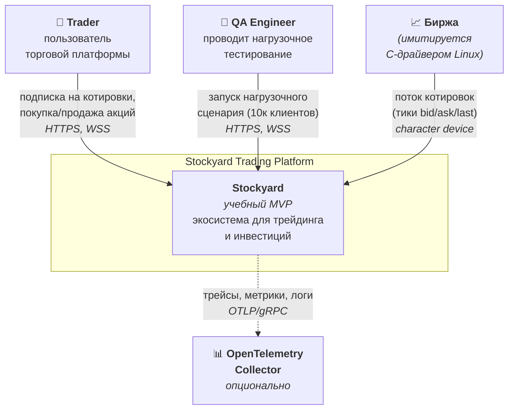
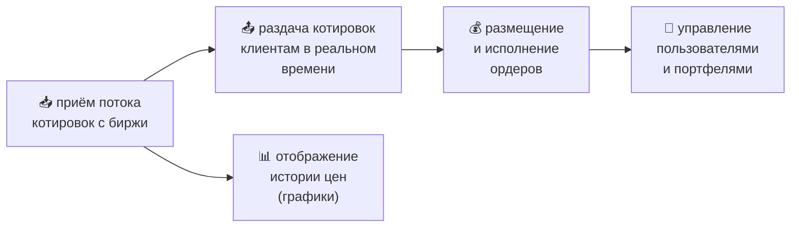

# 01. Контекст системы

## Назначение

Показать Stockyard как **единый чёрный ящик** и его взаимодействия с внешними акторами и системами. Это самый верхний уровень детализации — нужен, чтобы у заинтересованных сторон было общее понимание границ системы.

## Контекстная диаграмма

## Акторы

| Актор | Роль | Канал взаимодействия | Объём |
|---|---|---|---|
| **Trader** | Конечный пользователь, заходит с мобильного приложения | Android (Kotlin + Compose) или RN-клиент | до 10 000 одновременно |
| **QA Engineer** | Запускает Load Simulator для проверки SLO | API Gateway (через тот же публичный API) | по требованию |

## Внешние системы

| Система | Описание | Канал |
|---|---|---|
| **«Биржа»** | Источник котировок, имитируется C Linux Driver | Character device `/dev/stockyard` или netlink |
| **OpenTelemetry Collector** | Опциональный сборщик телеметрии для observability | OTLP/gRPC |

## Бизнес-функции (что делает система)

## Что система НЕ делает (out of scope)

| Функция | Почему out of scope |
|---|---|
| Реальный matching engine с order book | Учебный MVP — исполняем «по рынку» по текущей цене |
| Интеграция с реальными биржами (MOEX, NYSE) | Используется имитация через C-драйвер |
| KYC, верификация документов клиента | Регистрация по email + пароль, без проверок |
| Реальные платежи, ввод/вывод средств | Балансы фиктивные, начисляются при регистрации |
| Push-уведомления, SMS, email | Не предусмотрено ТЗ |
| Аналитика, торговые рекомендации, AI-сигналы | Не предусмотрено ТЗ |
| Социальные функции (чат, лента, копитрейдинг) | Не предусмотрено ТЗ |

## Контекстные ограничения

### Функциональные
- Поддержка **до 10 000 одновременных клиентов** (по ТЗ).
- Каталог инструментов — фиксированный (десятки тикеров).
- Котировки — генерируются драйвером (random walk).

### Нефункциональные
- Цель — **MVP**, программа может иногда падать, документация может содержать пробелы.
- Стек технологий **зафиксирован** в [REQUIREMENTS.md](../../REQUIREMENTS.md), отклонение → штраф.
- Ориентир по latency: WS-доставка тика клиенту < 500 мс p95.
- Ориентир по доступности: best effort, без HA-требований.

### Организационные
- Команда — до 10 человек (разработчики курса РМП).
- Срок — один семестр.

## Заинтересованные стороны (stakeholders)

| Сторона | Что ожидает |
|---|---|
| Преподаватель | Соответствие ТЗ, понятный отчёт, рабочий MVP |
| Студенты-разработчики | Возможность работать параллельно, понятная архитектура |
| «Заказчик» (фиктивный) | Работающая платформа на 10к клиентов |

## Связанные документы

- ➡ [02. Структура системы](02-containers.md) — раскрытие чёрного ящика.
- ➡ [10. Ключевые сценарии](10-scenarios.md) — основные сценарии использования.
