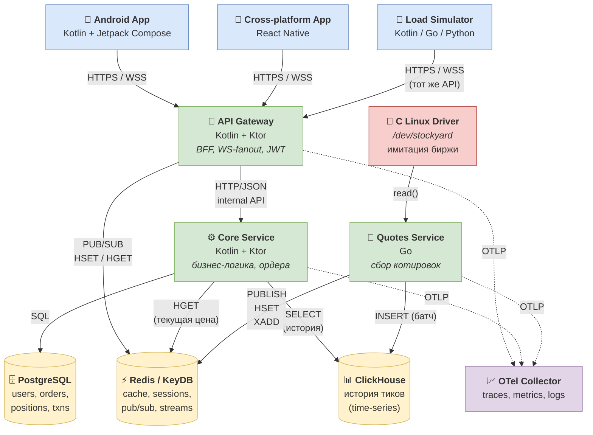
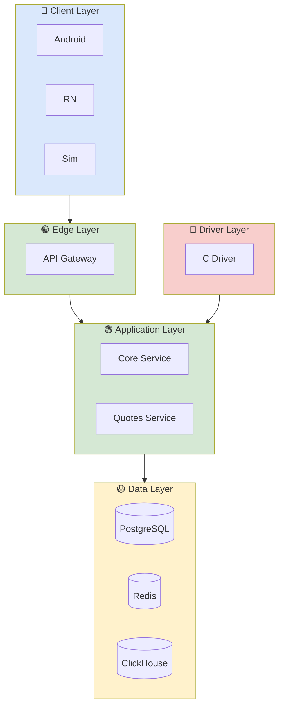
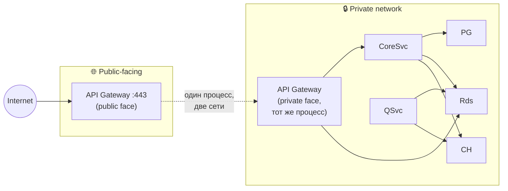

# 02. Структура системы

## Назначение

Раскрыть «чёрный ящик» Stockyard в **развёртываемые единицы**: микросервисы, клиенты, хранилища и инфраструктурные компоненты. Под «контейнером» здесь понимается отдельный исполняемый процесс — не Docker-контейнер (хотя для Stockyard почти всё пакуется в Docker).

## Container-диаграмма

## Каталог контейнеров

### Клиенты

| Контейнер | Технология | Назначение | Источник в ТЗ |
|---|---|---|---|
| **Android App** | Kotlin + Jetpack Compose | Нативное мобильное приложение | п.1 |
| **Cross-platform App** | React Native | Кросс-платформенный клиент | п.2 |
| **Load Simulator** | Kotlin / Go / Python | Имитация 10к клиентов для тестов | п.5 |

### Микросервисы

| Контейнер | Технология | Назначение | Источник в ТЗ |
|---|---|---|---|
| **API Gateway** | Kotlin + Ktor | Единая точка входа, JWT-auth, fanout котировок | п.3 |
| **Core Service** | Kotlin + Ktor | Бизнес-логика, ордера, портфели | п.4 |
| **Quotes Service** | Go | Чтение драйвера и публикация котировок | п.6 |

### Системные компоненты

| Контейнер | Технология | Назначение | Источник в ТЗ |
|---|---|---|---|
| **C Linux Driver** | C, kernel module / character device | Имитация биржи, поток тиков | п.7 |

### Хранилища (готовые компоненты)

| Контейнер | Назначение |
|---|---|
| **PostgreSQL** | OLTP: пользователи, ордера, позиции, транзакции |
| **Redis / KeyDB** | Кэш текущих котировок, сессии, pub/sub, streams |
| **ClickHouse** | Time-series: история тиков для графиков |

### Observability

| Контейнер | Назначение |
|---|---|
| **OpenTelemetry Collector** | Приёмник трейсов/метрик/логов, экспорт в Jaeger/Prometheus/Loki |

## Группировка по слоям (logical layering)

## Принципы границ контейнеров

1. **Один процесс — одна зона ответственности** (Single Responsibility).
2. **Stateless по умолчанию** — состояние только в Data Layer.
3. **Однонаправленность зависимостей** — Edge зовёт Application, Application пишет в Data; обратных вызовов нет.
4. **Разные языки → разные контейнеры** (требование ТЗ): Kotlin, Go, C — отдельные процессы.
5. **Один публичный вход** — API Gateway. Все остальные сервисы — приватные.

## Какие контейнеры публичны

API Gateway — **multi-homed**: один процесс с интерфейсами в обеих сетях. Снаружи слушает HTTPS/WSS на :443, изнутри ходит к Core Service и Redis. Все остальные сервисы и хранилища — только в приватной сети.

**Только API Gateway** доступен из публичной сети. Прямого доступа извне к Core Service, Quotes Service или хранилищам нет.

## Связанные документы

- ⬅ [01. Контекст системы](01-context.md)
- ➡ [03. Внутреннее устройство сервисов](03-components.md) — что внутри каждого сервиса.
- ➡ [04. Развёртывание и топология](04-deployment.md) — как сервисы разворачиваются физически.
- ➡ [05. Коммуникация и API](05-communication.md) — какие протоколы используются между ними.
