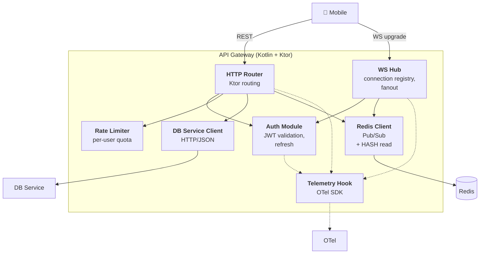
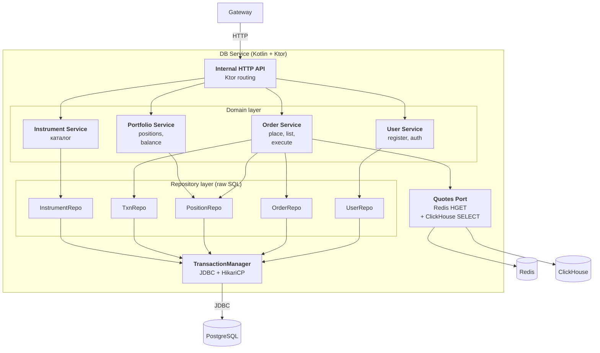
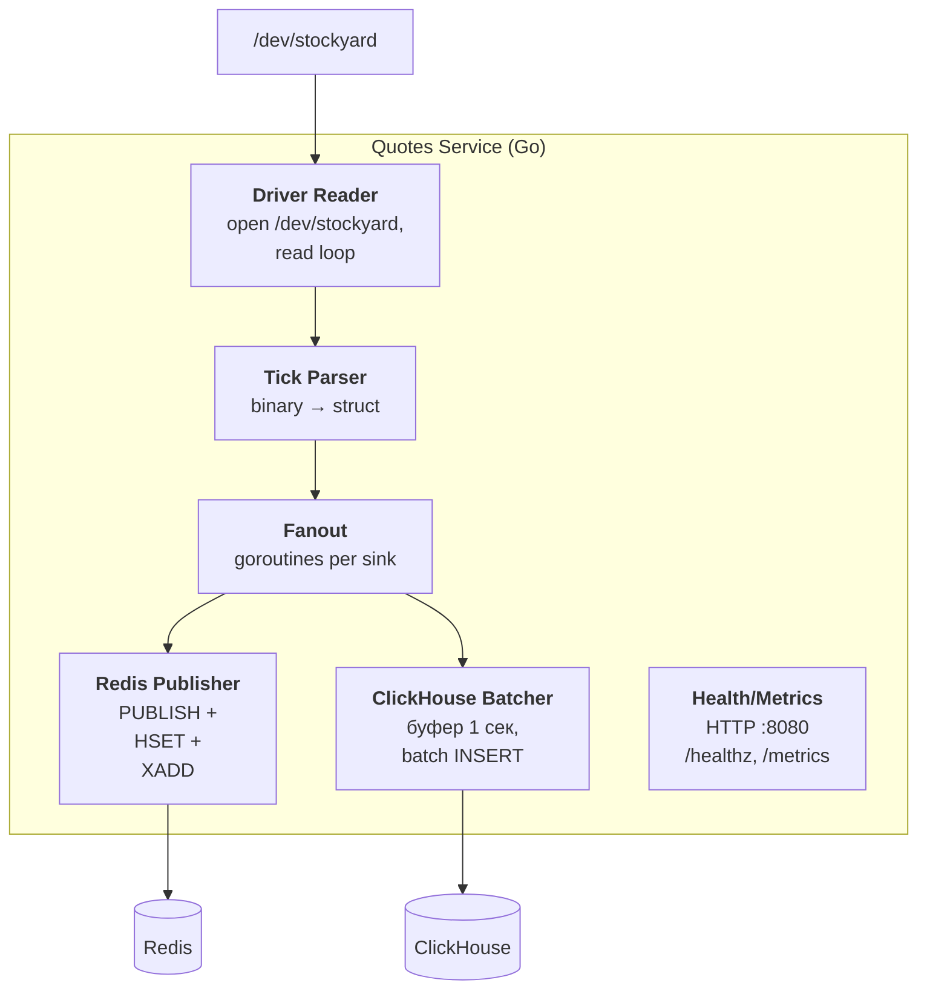
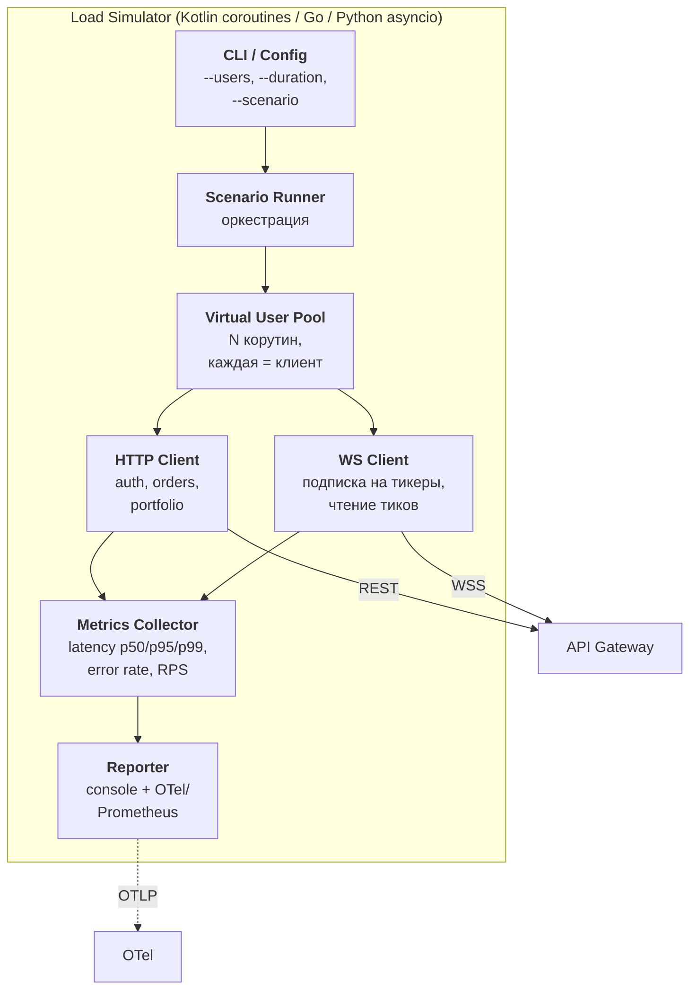
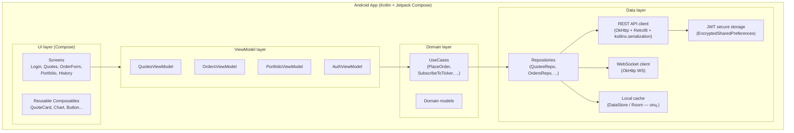
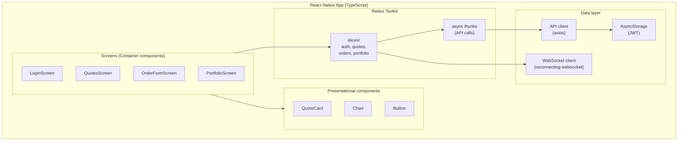

# 03. Внутреннее устройство сервисов

## Назначение

Раскрыть **внутреннее устройство каждого микросервиса** — на какие модули/компоненты он делится, как они связаны и где какой код живёт.

Это уровень детализации, на котором разработчик может начать кодить, понимая, какой код в какой пакет/модуль попадает.

---

## 3.1. API Gateway (Ktor)

### Назначение
Единственная публичная точка входа. Принимает мобильные запросы, аутентифицирует, маршрутизирует во внутренние сервисы, делает fanout котировок по WebSocket.

### Компонентная диаграмма



### Компоненты

| Компонент | Ответственность |
|---|---|
| **HTTP Router** | Маршрутизация REST: `/auth`, `/orders`, `/portfolio`, `/instruments`, `/quotes/*`. |
| **WS Hub** | Реестр открытых WS-соединений, подписка/отписка на тикеры, fanout входящих pub/sub-сообщений. |
| **Auth Module** | Выпуск/валидация JWT, refresh-tokens, blacklist в Redis. |
| **Rate Limiter** | Ограничение RPS на пользователя (token bucket в Redis). |
| **DB Service Client** | HTTP-клиент к DB Service (Ktor client + retry/timeout). |
| **Redis Client** | Подписка на `channel:quotes:*`, чтение `quotes:{ticker}`. |
| **Telemetry Hook** | Перехват входящих/исходящих вызовов для трейсинга. |

### Структура исходников

```
gateway/
├── src/main/kotlin/com/stockyard/gateway/
│   ├── Application.kt              # точка входа Ktor
│   ├── config/
│   │   ├── AppConfig.kt
│   │   └── Plugins.kt              # Auth, RateLimit, OTel installation
│   ├── routing/
│   │   ├── AuthRoutes.kt
│   │   ├── OrdersRoutes.kt
│   │   ├── PortfolioRoutes.kt
│   │   ├── InstrumentsRoutes.kt
│   │   └── QuotesRoutes.kt
│   ├── ws/
│   │   ├── WsHub.kt                # connection registry
│   │   └── QuotesSubscriber.kt     # Redis pub/sub bridge
│   ├── auth/
│   │   ├── JwtVerifier.kt
│   │   └── SessionStore.kt
│   ├── client/
│   │   └── DbServiceClient.kt
│   └── telemetry/
│       └── OtelInit.kt
└── build.gradle.kts
```

---

## 3.2. DB Service (Kotlin)

### Назначение
Источник истины по бизнес-сущностям: пользователи, балансы, ордера, портфели. Вся транзакционная логика — здесь.

### Компонентная диаграмма



### Компоненты

| Компонент | Ответственность |
|---|---|
| **Internal HTTP API** | REST-эндпоинты для Gateway (`/internal/*`). |
| **User Service** | Регистрация, логин, хэш паролей (Argon2/BCrypt). |
| **Order Service** | Создание ордера, валидация, исполнение по рынку, обновление позиции и баланса в одной TX. |
| **Portfolio Service** | Чтение портфеля, балансов, истории транзакций. |
| **Instrument Service** | Чтение каталога инструментов. |
| **Repositories** | Голый SQL (по требованию ТЗ), без ORM. |
| **TransactionManager** | Connection pool (HikariCP) + явное управление транзакциями. |
| **Quotes Port** | Адаптер для чтения текущей цены из Redis и истории из ClickHouse. |

### Структура исходников

```
db-service/
├── src/main/kotlin/com/stockyard/db/
│   ├── Application.kt
│   ├── api/
│   │   ├── UserApi.kt
│   │   ├── OrderApi.kt
│   │   ├── PortfolioApi.kt
│   │   └── InstrumentApi.kt
│   ├── domain/
│   │   ├── user/
│   │   │   ├── User.kt
│   │   │   ├── UserService.kt
│   │   │   └── UserRepository.kt
│   │   ├── order/
│   │   │   ├── Order.kt
│   │   │   ├── OrderService.kt
│   │   │   └── OrderRepository.kt
│   │   ├── portfolio/
│   │   │   ├── Position.kt
│   │   │   ├── PortfolioService.kt
│   │   │   └── PositionRepository.kt
│   │   └── instrument/
│   │       ├── Instrument.kt
│   │       └── InstrumentRepository.kt
│   ├── persistence/
│   │   └── TransactionManager.kt
│   ├── ports/
│   │   └── QuotesPort.kt
│   └── telemetry/
│       └── OtelInit.kt
├── src/main/resources/
│   └── db/migration/              # Flyway миграции
│       ├── V1__init.sql
│       ├── V2__instruments.sql
│       └── ...
└── build.gradle.kts
```

---

## 3.3. Quotes Service (Go)

### Назначение
Stream-процессор: читает поток тиков из C-драйвера и распространяет его по системе (Redis pub/sub, Redis cache, ClickHouse).

### Компонентная диаграмма



### Компоненты

| Компонент | Ответственность |
|---|---|
| **Driver Reader** | Открыть `/dev/stockyard`, читать в цикле, обрабатывать reconnect. |
| **Tick Parser** | Парсинг бинарного формата тика в структуру. |
| **Fanout** | Распределение каждого тика по нескольким приёмникам через каналы (channels). |
| **Redis Publisher** | `PUBLISH channel:quotes:{ticker}` + `HSET quotes:{ticker}` + `XADD stream:quotes`. |
| **ClickHouse Batcher** | Накопление тиков в буфере, batch INSERT раз в секунду. |
| **Health/Metrics** | Минимальный HTTP: `/healthz`, `/metrics` для Prometheus. |

### Структура исходников

```
quotes-service/
├── cmd/quotes/
│   └── main.go
├── internal/
│   ├── driver/
│   │   ├── reader.go              # /dev/stockyard
│   │   └── parser.go
│   ├── pipeline/
│   │   ├── fanout.go
│   │   └── tick.go                # типы
│   ├── sinks/
│   │   ├── redis.go
│   │   └── clickhouse.go
│   ├── health/
│   │   └── server.go
│   └── telemetry/
│       └── otel.go
├── go.mod
└── go.sum
```

---

## 3.4. Load Simulator

### Назначение
Имитирует 10 000 одновременных клиентов, бьющихся в публичный API Gateway. Используется для системного тестирования и доказательства соответствия SLO.

### Компонентная диаграмма



### Компоненты

| Компонент | Ответственность |
|---|---|
| **CLI / Config** | Параметры запуска: число клиентов, длительность, тип сценария. |
| **Scenario Runner** | Оркестрация: ramp-up, steady state, ramp-down. |
| **Virtual User Pool** | N лёгких единиц параллелизма, каждая ведёт себя как один клиент. |
| **HTTP Client** | REST-вызовы (login, orders, portfolio). |
| **WS Client** | Подписка на котировки, чтение тиков. |
| **Metrics Collector** | Сбор latency, ошибок, RPS. |
| **Reporter** | Вывод в консоль и/или OTel/Prometheus. |

### Сценарии

| Сценарий | Описание |
|---|---|
| `smoke` | 10 клиентов, 1 минута — проверка работоспособности |
| `realistic` | 10 000 клиентов, 10 минут, mix 80/20 read/write |
| `stress` | плавный ramp-up до отказа, фиксация breaking point |
| `soak` | 5 000 клиентов, 1 час — поиск утечек |

### Структура исходников

```
load-simulator/
├── src/main/kotlin/com/stockyard/sim/
│   ├── Main.kt
│   ├── config/
│   │   └── SimConfig.kt
│   ├── runner/
│   │   ├── ScenarioRunner.kt
│   │   ├── RealisticScenario.kt
│   │   └── StressScenario.kt
│   ├── client/
│   │   ├── VirtualUser.kt
│   │   ├── HttpApi.kt
│   │   └── WsApi.kt
│   └── metrics/
│       ├── Histogram.kt
│       └── Reporter.kt
└── build.gradle.kts
```

---

## 3.5. C Linux Driver

### Назначение
Имитирует биржу: генерирует поток тиков (random walk цен) и отдаёт его через character device.

### Компоненты

| Компонент | Ответственность |
|---|---|
| **Module init/exit** | Регистрация character device при `insmod`. |
| **Tick Generator** | Таймер ядра, генерирует тики раз в N мс. |
| **Random Walk Engine** | Изменение цен инструментов с заданной волатильностью. |
| **Char Device Ops** | `read()`/`poll()` интерфейс для пользовательского пространства. |
| **Ring Buffer** | Хранение последних N тиков на случай медленного читателя. |

### Файлы

```
driver/
├── Makefile
├── stockyard_driver.c
├── stockyard_driver.h
└── README.md
```

### Интерфейс пользовательского пространства

```c
// /dev/stockyard, формат тика — packed struct
struct stockyard_tick {
    char     ticker[8];    // null-padded
    uint64_t ts_ns;        // monotonic timestamp
    int64_t  bid_cents;
    int64_t  ask_cents;
    int64_t  last_cents;
    uint32_t volume;
} __attribute__((packed));
```

---

## 3.6. Android-приложение

### Назначение
Нативный мобильный клиент для трейдеров. Показывает котировки в реальном времени, портфель и позволяет размещать ордера.

### Архитектура: MVVM + Clean layers



### Компоненты

| Компонент | Ответственность |
|---|---|
| **Screens (Compose)** | Декларативная разметка экранов. Без бизнес-логики. |
| **ViewModels** | UI state holders, переживают rotation. Подписываются на потоки из репозиториев через `StateFlow`. |
| **UseCases** | Один use case = одно бизнес-действие (place order, subscribe to quotes). Облегчают юнит-тестирование. |
| **Repositories** | Скрывают источник данных (REST / WS / cache) от верхних слоёв. |
| **REST API client** | Retrofit + OkHttp + kotlinx.serialization. Перехватчик подставляет JWT. |
| **WebSocket client** | OkHttp WebSocket. Авто-reconnect с exponential backoff. |
| **JWT secure storage** | Refresh-token шифруется через EncryptedSharedPreferences. |

### Структура исходников

```
android-app/
├── app/src/main/kotlin/com/stockyard/android/
│   ├── MainActivity.kt
│   ├── ui/
│   │   ├── theme/
│   │   ├── screens/
│   │   │   ├── login/LoginScreen.kt
│   │   │   ├── quotes/QuotesScreen.kt
│   │   │   ├── order/OrderFormScreen.kt
│   │   │   ├── portfolio/PortfolioScreen.kt
│   │   │   └── history/HistoryScreen.kt
│   │   └── components/
│   │       ├── QuoteCard.kt
│   │       └── PriceChart.kt
│   ├── viewmodel/
│   ├── domain/
│   │   ├── model/
│   │   └── usecase/
│   ├── data/
│   │   ├── api/                # Retrofit interfaces
│   │   ├── ws/
│   │   ├── repository/
│   │   └── auth/
│   └── di/                     # Hilt modules
└── build.gradle.kts
```

### Технические решения
- **DI:** Hilt (стандарт для Android).
- **Navigation:** Jetpack Navigation Compose.
- **Async:** Kotlin coroutines + Flow.
- **Charts:** простая Compose-реализация на Canvas (или `compose-charts` если время позволит).

---

## 3.7. React Native приложение

### Назначение
Кросс-платформенный клиент (iOS + Android) — выполняет роль аналога Android-клиента, но на одной кодовой базе.

### Архитектура: Container / Presentational + Redux Toolkit



### Компоненты

| Компонент | Ответственность |
|---|---|
| **Screens** | Container-компоненты, подключены к Redux store через `useSelector` / `useDispatch`. |
| **Presentational components** | Чистые React-компоненты без знания о store. |
| **Redux slices** | State + reducers, по одному на домен (auth, quotes, orders, portfolio). |
| **Async thunks** | Обёртка над API-вызовами (createAsyncThunk). |
| **API client** | Axios + перехватчик с JWT. |
| **WebSocket client** | Реconnecting-WS с auto-resubscribe на тикеры. |
| **AsyncStorage** | Refresh-token (с использованием `react-native-keychain` для надёжности). |

### Структура исходников

```
rn-app/
├── src/
│   ├── App.tsx
│   ├── navigation/
│   │   └── RootNavigator.tsx
│   ├── screens/
│   │   ├── LoginScreen.tsx
│   │   ├── QuotesScreen.tsx
│   │   ├── OrderFormScreen.tsx
│   │   └── PortfolioScreen.tsx
│   ├── components/
│   ├── store/
│   │   ├── index.ts
│   │   └── slices/
│   │       ├── authSlice.ts
│   │       ├── quotesSlice.ts
│   │       └── ordersSlice.ts
│   ├── api/
│   │   ├── client.ts
│   │   └── ws.ts
│   └── types/
├── package.json
└── tsconfig.json
```

### Технические решения
- **Navigation:** React Navigation (stack + bottom tabs).
- **TypeScript:** обязателен — статическая типизация контрактов с API.
- **Charts:** `victory-native` или `react-native-chart-kit`.
- **Тестирование:** Jest + React Testing Library (см. [11. Тестирование](11-testing.md)).

---

## Связанные документы

- ⬅ [02. Структура системы](02-containers.md)
- ➡ [04. Развёртывание и топология](04-deployment.md)
- ➡ [05. Коммуникация и API](05-communication.md)
- ➡ [06. Архитектура данных](06-data.md)
