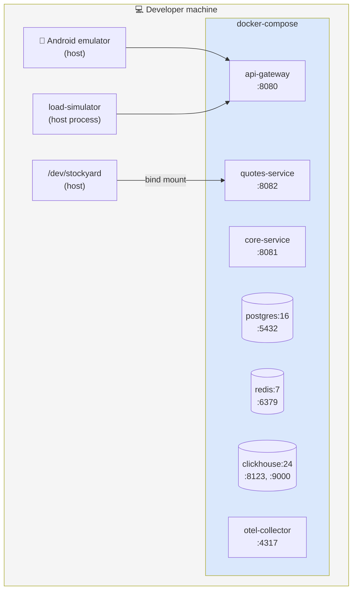
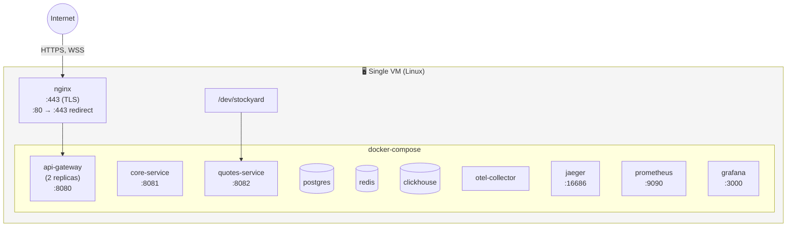
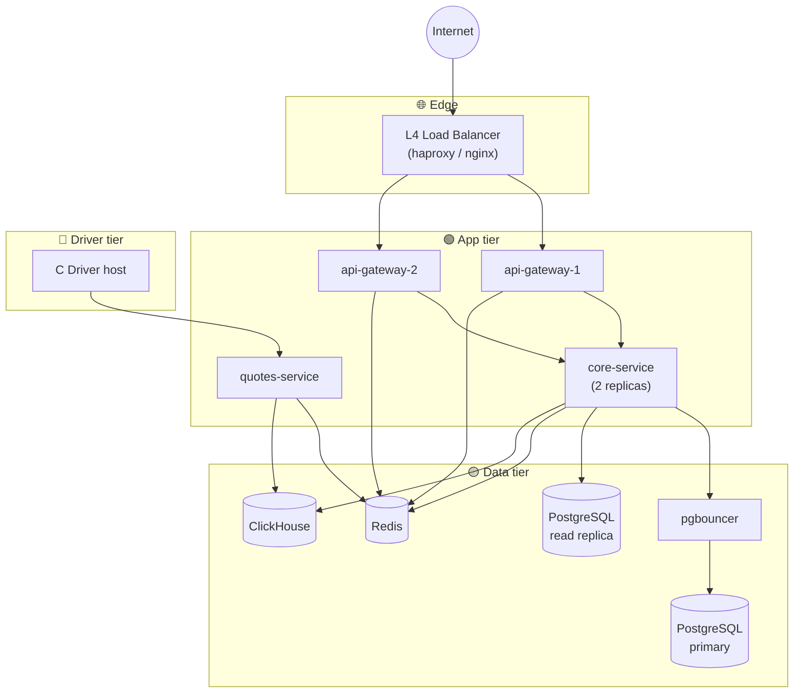
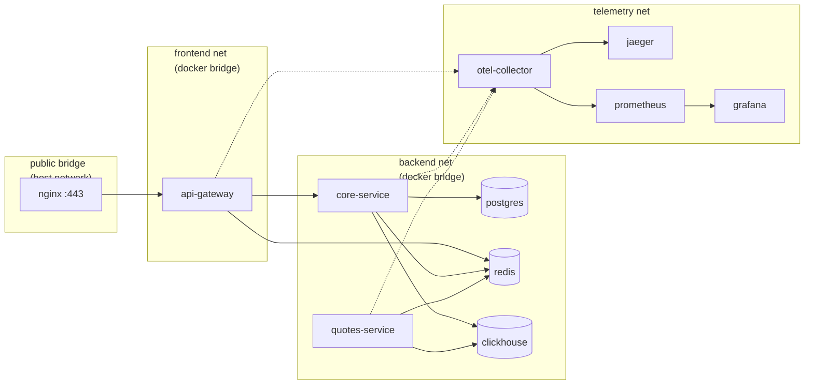
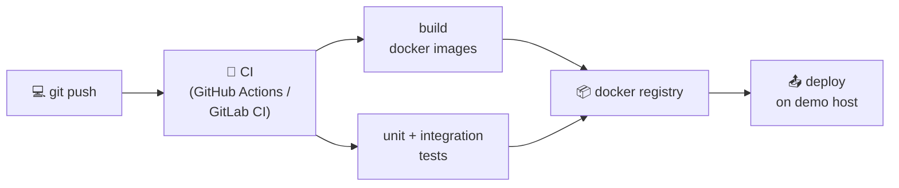

# 04. Развёртывание и топология

## Назначение

Описать **физическое развёртывание** системы: как процессы маппятся на хосты, Docker-контейнеры, сети и порты.

---

## 4.1. Принципы развёртывания

1. **Всё в Docker** (кроме C-драйвера) — одинаковая среда у всех в команде, простой запуск через `docker compose up`.
2. **C-драйвер** — устанавливается на Linux-хост через `insmod`, монтируется в Quotes Service как character device.
3. **Один публичный порт** — TLS-терминация на reverse proxy перед Gateway (для prod-like setup) или прямо на Gateway (для dev).
4. **Приватная сеть** для всего, кроме Gateway — никаких прямых обращений к БД и сервисам извне.
5. **Stateful компоненты** (PG, Redis, CH) — отдельные именованные тома Docker для персистентности.

> ### ⚠️ Хостовая ОС: ограничение для macOS-разработчиков
>
> C-драйвер — это **Linux kernel module**, его нельзя `insmod` на macOS или нативной Windows.
> Команда обязана заранее договориться, кто работает на какой ОС. Возможные варианты:
>
> | ОС разработчика | Как запускать систему |
> |---|---|
> | Linux (Ubuntu/Mint) | `insmod` → `docker compose up` напрямую |
> | macOS (Intel/Apple Silicon) | поднять Linux-VM (UTM, Lima, OrbStack) и работать внутри неё; либо использовать **Fake Driver** из [11. Тестирование §11.5.2](11-testing.md) для интеграционного режима |
> | Windows 10/11 | WSL2 с Ubuntu — `insmod` работает; либо Fake Driver |
>
> **Рекомендация:** хотя бы один член команды должен работать на нативном Linux (или WSL2), чтобы регулярно проверять реальный драйвер. Остальные могут пользоваться Fake Driver на этапе разработки своих сервисов.

---

## 4.2. Топологии развёртывания

Три варианта по сложности: **Dev**, **Demo (на одной машине)**, **Prod-like**.

### Вариант A: Dev (single host, docker-compose)

Для разработки на ноутбуке.



**Особенности:**
- Драйвер `insmod` на хосте, character device пробрасывается в Quotes Service через `--device=/dev/stockyard`.
- Mobile эмулятор обращается к `http://10.0.2.2:8080` (специальный адрес для Android emulator).
- Без TLS — только HTTP/WS.

### Вариант B: Demo (single host, prod-like)

Для запуска демо на одной VM/сервере с TLS.



**Особенности:**
- Nginx — TLS-терминатор и L7 LB перед Gateway.
- 2 реплики Gateway для имитации горизонтального масштабирования.
- Полный observability stack (Jaeger + Prometheus + Grafana).

### Вариант C: Prod-like (multi-host) 📦 Backlog

> Не реализуется в MVP. Описано как точка эволюции для отчёта/защиты — показать, как архитектура масштабируется при росте нагрузки.



---

## 4.3. Сетевая топология (Dev/Demo)



**Изоляция:**
- `frontend` сеть — только Gateway и nginx.
- `backend` сеть — все backend-сервисы и хранилища; **Gateway тоже в backend**, чтобы зват Core Service.
- `telemetry` сеть — отдельно, чтобы скачки телеметрии не влияли на основные пути.

---

## 4.4. Карта портов

| Сервис | Внутренний порт | Внешний порт (dev) | Протокол |
|---|---|---|---|
| nginx | 80 / 443 | 80 / 443 | HTTP / HTTPS |
| api-gateway | 8080 | 8080 (dev only) | HTTP / WS |
| core-service | 8081 | — | HTTP |
| quotes-service | 8082 | 8082 (только /metrics) | HTTP |
| postgres | 5432 | 5432 (dev only) | Postgres wire |
| redis | 6379 | 6379 (dev only) | RESP |
| clickhouse | 8123 / 9000 | 8123 (dev) | HTTP / TCP |
| otel-collector | 4317 / 4318 | — | OTLP gRPC / HTTP |
| jaeger | 16686 | 16686 | HTTP UI |
| prometheus | 9090 | 9090 | HTTP UI |
| grafana | 3000 | 3000 | HTTP UI |

«— » означает «доступ только из приватной сети, наружу не маппим».

---

## 4.5. Файлы развёртывания

```
deploy/
├── docker-compose.yml              # Dev
├── docker-compose.demo.yml         # Demo (с nginx, 2 реплики GW)
├── docker-compose.observability.yml
├── nginx/
│   ├── nginx.conf
│   └── certs/                      # self-signed для demo
├── postgres/
│   └── init.sql                    # Flyway применит после
├── clickhouse/
│   └── init.sql
├── otel-collector-config.yaml
├── prometheus.yml
└── grafana/
    ├── dashboards/
    │   ├── stockyard-overview.json
    │   ├── stockyard-services.json
    │   └── stockyard-quotes.json
    └── datasources/
        └── prometheus.yaml
```

---

## 4.6. Sizing (расчёт ресурсов)

### Dev (один разработчик, smoke test)

| Сервис | CPU | RAM |
|---|---|---|
| api-gateway | 0.5 | 512 MB |
| core-service | 0.5 | 512 MB |
| quotes-service | 0.25 | 256 MB |
| postgres | 0.5 | 512 MB |
| redis | 0.25 | 256 MB |
| clickhouse | 0.5 | 1 GB |
| **Итого** | **~2.5 vCPU** | **~3 GB** |

Помещается на любой современный ноутбук.

### Demo (10к concurrent на одной VM)

| Сервис | CPU | RAM | Примечание |
|---|---|---|---|
| nginx | 0.5 | 256 MB | |
| api-gateway × 2 | 1 each = 2 | 1 GB each = 2 GB | держат 5к WS каждый |
| core-service | 1 | 1 GB | |
| quotes-service | 0.5 | 512 MB | |
| postgres | 2 | 4 GB | shared_buffers 1 GB |
| redis | 1 | 1 GB | |
| clickhouse | 2 | 4 GB | |
| otel + jaeger + prom + grafana | 2 | 2 GB | |
| **Итого** | **~11 vCPU** | **~15 GB** | |

Помещается в одну VM 16 vCPU / 16 GB RAM (например, c5.4xlarge или аналог).

---

## 4.7. Команды запуска

### Dev
```bash
# Один раз
sudo insmod driver/stockyard_driver.ko

# Каждый запуск
docker compose up -d

# Логи
docker compose logs -f api-gateway

# Smoke test
./load-simulator --users 10 --duration 30s
```

### Demo
```bash
docker compose -f deploy/docker-compose.demo.yml up -d
docker compose -f deploy/docker-compose.observability.yml up -d
```

### Тушение
```bash
docker compose down            # сохранит volumes
docker compose down -v         # снесёт volumes (БД)
sudo rmmod stockyard_driver
```

---

## 4.8. CI/CD (минимальный)



Минимум для MVP:
- На каждый push в `main` — сборка образов и юнит-тесты.
- Ручной trigger для деплоя на demo.

---

## Связанные документы

- ⬅ [03. Внутреннее устройство сервисов](03-components.md)
- ➡ [05. Коммуникация и API](05-communication.md)
- ➡ [08. Масштабирование и производительность](08-scaling.md)
