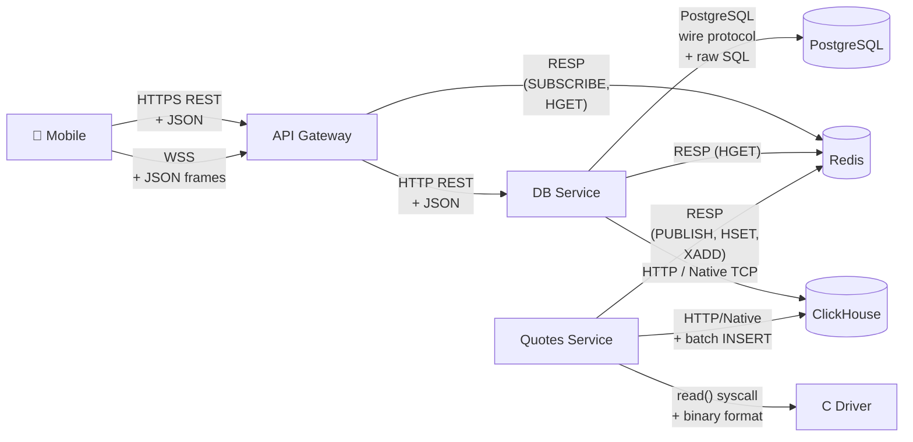
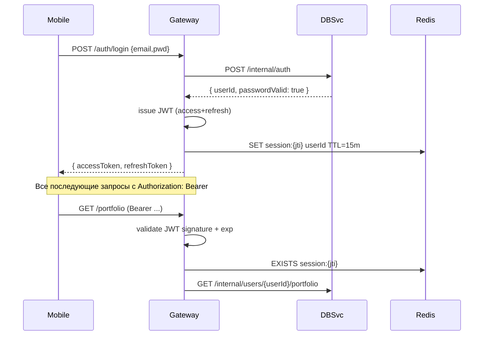

# 05. Коммуникация и API

## Назначение

Описать **протоколы, форматы и контракты** взаимодействия между всеми компонентами системы — что куда ходит, в каком формате и с какими гарантиями.

---

## 5.1. Карта коммуникаций



---

## 5.2. Стили коммуникаций

| Граница | Стиль | Протокол | Формат | Sync/Async |
|---|---|---|---|---|
| Mobile ↔ Gateway (запросы) | request/response | HTTPS REST | JSON | sync |
| Mobile ↔ Gateway (котировки) | streaming | WSS | JSON frames | async, server-push |
| Gateway ↔ DB Service | request/response | HTTP/1.1 | JSON | sync |
| Quotes ↔ Gateway | pub/sub | Redis Pub/Sub (RESP) | binary / JSON | async |
| Driver ↔ Quotes | streaming | char device read() | packed binary | sync, blocking |
| Service ↔ PostgreSQL | request/response | PG wire | raw SQL + bind | sync |
| Service ↔ Redis | request/response + pub/sub | RESP | binary | sync (cmd) / async (sub) |
| Service ↔ ClickHouse | request/response | HTTP / native | JSON / binary | sync |

---

## 5.3. Внешний API (Mobile ↔ Gateway)

### 5.3.1. Базовые принципы

- **REST** для запрос/ответ, **WSS** для потока котировок.
- Все REST-запросы (кроме `/auth/*`) — с `Authorization: Bearer <JWT>`.
- Все ошибки в едином формате `{ "error": { "code": "...", "message": "..." } }`.
- Версионирование: префикс `/v1/`.
- Идемпотентность критичных POST через `Idempotency-Key` header.

### 5.3.2. Эндпоинты (REST)

#### Аутентификация

```http
POST /v1/auth/register
Content-Type: application/json

{
  "email": "user@example.com",
  "password": "secret"
}

→ 201 Created
{
  "userId": "u_abc123",
  "accessToken": "eyJhbGc...",
  "refreshToken": "eyJhbGc...",
  "expiresIn": 900
}
```

```http
POST /v1/auth/login
{ "email": "...", "password": "..." }

→ 200 OK
{ "accessToken": "...", "refreshToken": "...", "expiresIn": 900 }
```

```http
POST /v1/auth/refresh
{ "refreshToken": "..." }

→ 200 OK
{ "accessToken": "...", "expiresIn": 900 }
```

#### Каталог инструментов

```http
GET /v1/instruments
Authorization: Bearer <JWT>

→ 200 OK
{
  "items": [
    {"ticker": "SBER", "name": "Сбербанк", "lotSize": 10},
    {"ticker": "GAZP", "name": "Газпром",   "lotSize": 10}
  ]
}
```

#### Котировки

```http
GET /v1/quotes/SBER

→ 200 OK
{
  "ticker": "SBER",
  "ts": "2026-05-09T12:34:56.789Z",
  "bid": 285.50,
  "ask": 285.70,
  "last": 285.60,
  "volume": 12345
}
```

```http
GET /v1/quotes/SBER/history?from=2026-05-09T00:00Z&to=2026-05-09T23:59Z&interval=1m

→ 200 OK
{
  "ticker": "SBER",
  "interval": "1m",
  "candles": [
    {"ts": "...", "open": ..., "high": ..., "low": ..., "close": ..., "volume": ...},
    ...
  ]
}
```

#### Ордера

```http
POST /v1/orders
Authorization: Bearer <JWT>
Idempotency-Key: 9c44b7e2-...

{
  "ticker": "SBER",
  "side": "BUY",
  "qty": 10
}

→ 201 Created
{
  "orderId": "o_xyz789",
  "status": "EXECUTED",
  "ticker": "SBER",
  "side": "BUY",
  "qty": 10,
  "price": 285.70,
  "executedAt": "..."
}
```

```http
GET /v1/orders?status=EXECUTED&limit=50&cursor=...

→ 200 OK
{ "items": [...], "nextCursor": "..." }
```

#### Портфель

```http
GET /v1/portfolio

→ 200 OK
{
  "balance": { "amount": 100000.00, "currency": "RUB" },
  "positions": [
    {"ticker": "SBER", "qty": 10, "avgPrice": 280.00, "currentPrice": 285.60}
  ]
}
```

### 5.3.3. WebSocket-протокол

Подключение: `wss://stockyard.example/v1/ws?token=<JWT>` (или `Authorization: Bearer` через subprotocol).

#### Сообщения от клиента

```json
{ "action": "subscribe",   "tickers": ["SBER", "GAZP"] }
{ "action": "unsubscribe", "tickers": ["SBER"] }
{ "action": "ping" }
```

#### Сообщения от сервера

```json
// Тик котировки
{
  "type": "quote",
  "ticker": "SBER",
  "ts": "2026-05-09T12:34:56.789Z",
  "bid": 285.50, "ask": 285.70, "last": 285.60
}

// Подтверждение подписки
{ "type": "subscribed", "tickers": ["SBER", "GAZP"] }

// Ошибка
{ "type": "error", "code": "INVALID_TICKER", "message": "..." }

// Heartbeat (раз в 30 сек)
{ "type": "pong" }
```

#### Контракт надёжности

- Сервер отправляет `pong` каждые 30 секунд; клиент должен отвечать на `ping`.
- Если клиент не присылает ничего > 60 сек — соединение закрывается с кодом `1008`.
- Backpressure: если клиент медленно читает, сервер дропает старые тики (не блокирует publisher).

---

## 5.4. Внутренний API (Gateway ↔ DB Service)

### 5.4.1. Принципы

- **HTTP/1.1 + JSON** — для простоты (не gRPC, чтобы не плодить инфраструктуру).
- Префикс `/internal/` — никогда не выставляется наружу.
- Без аутентификации (приватная сеть). Опционально — общий внутренний токен.
- Тот же формат ошибок, что и наружу.

### 5.4.2. Примеры эндпоинтов

```http
POST /internal/users
{ "email": "...", "passwordHash": "argon2$..." }

→ 201 { "userId": "u_abc123" }
```

```http
POST /internal/auth
{ "email": "...", "password": "..." }

→ 200 { "userId": "u_abc123", "passwordValid": true }
```

```http
POST /internal/orders
{ "userId": "u_abc123", "ticker": "SBER", "side": "BUY", "qty": 10 }

→ 201 { "orderId": "o_xyz", "status": "EXECUTED", "price": 285.70 }
```

```http
GET /internal/users/u_abc123/portfolio

→ 200 { "balance": ..., "positions": [...] }
```

---

## 5.5. Поток котировок (driver → Quotes → Redis → Gateway)

### 5.5.1. Драйвер → Quotes Service

Бинарный формат, packed struct (см. [03-components](03-components.md)):

```c
struct stockyard_tick {
    char     ticker[8];    // null-padded
    uint64_t ts_ns;
    int64_t  bid_cents;
    int64_t  ask_cents;
    int64_t  last_cents;
    uint32_t volume;
} __attribute__((packed));
```

Quotes Service делает блокирующий `read()` и парсит каждый тик.

### 5.5.2. Quotes Service → Redis

Каждый тик публикуется тремя путями:

```
PUBLISH channel:quotes:SBER  '{"ts":"...","bid":285.50,"ask":285.70,"last":285.60}'
HSET    quotes:SBER  ts ... bid 285.50 ask 285.70 last 285.60 volume 12345
XADD    stream:quotes  *  ticker SBER  ts ...  bid ...  ask ...  last ...
```

- `PUBLISH` — fanout без durability (горячая шина для Gateway).
- `HSET` — последняя котировка для синхронных читателей (DB Service при исполнении ордеров).
- `XADD` — durable backup на случай, если кто-то хочет догнать пропущенное.

### 5.5.3. Quotes Service → ClickHouse

Батчем раз в секунду:

```sql
INSERT INTO quotes_ticks (ticker, ts, bid, ask, last, volume) VALUES
  ('SBER', '...', 285.50, 285.70, 285.60, 12345),
  ('GAZP', '...', ...),
  ...
```

### 5.5.4. Redis → Gateway → Mobile

Gateway держит подписку:

```
SUBSCRIBE channel:quotes:*
```

И на каждое сообщение делает fanout по WS-соединениям, у которых клиент подписан на этот тикер. Никакой трансформации — переотправка как есть.

---

## 5.6. Форматы и кодировки

| Где | Формат | Почему |
|---|---|---|
| REST body | JSON (UTF-8) | стандарт, простой дебаг, инструменты |
| WS frames | JSON | то же |
| Driver tick | packed binary C struct | производительность, ядро не делает JSON |
| Internal API | JSON | Симметричен с внешним, проще |
| Redis values | JSON / RESP-native | публикуем JSON-ы; HASH-поля — нативные |
| ClickHouse | native binary protocol | производительность вставок |
| Логи | JSON lines (NDJSON) | structured logging |
| Трейсы / метрики | OTLP (Protobuf) | стандарт OpenTelemetry |

---

## 5.7. Обработка ошибок и таймауты

### Уровни

```
Mobile ──[5s timeout]──► Gateway ──[2s timeout]──► DB Service ──[1s]──► PG/Redis
```

### Формат ошибок

```json
{
  "error": {
    "code": "INSUFFICIENT_FUNDS",
    "message": "Not enough balance to place order",
    "details": { "required": 2857.00, "available": 1000.00 }
  }
}
```

### HTTP статусы

| Код | Когда |
|---|---|
| 400 | Невалидный запрос (синтаксис, типы) |
| 401 | Нет/невалидный JWT |
| 403 | JWT валиден, но нет прав |
| 404 | Сущность не найдена |
| 409 | Конфликт (idempotency key совпадает с другим телом) |
| 422 | Бизнес-ошибка (INSUFFICIENT_FUNDS, INVALID_TICKER) |
| 429 | Rate limit |
| 500 | Внутренняя ошибка |
| 503 | Downstream недоступен |

### Retry policy

| От → к | Таймаут | Retries |
|---|---|---|
| Mobile → Gateway | 5s | 1 (только для GET) |
| Gateway → DB Service | 2s | 2 с экспоненциальным бэкоффом, только для идемпотентных |
| DB Service → PostgreSQL | 1s | без ретраев (TX откатывается) |
| Service → Redis | 200ms | 3 — это кэш, не страшно повторить |
| Service → ClickHouse | 5s (для INSERT) | 5 — батчи нельзя терять |

---

## 5.8. Аутентификация и авторизация

### JWT

- **Access token** — короткий (15 мин), HS256 с секретом.
- **Refresh token** — длинный (30 дней), хранится в Redis с возможностью отзыва.
- Claims: `sub` (userId), `iat`, `exp`, `jti` (для отзыва).

### Поток



### Rate limiting

Token bucket в Redis:
```
INCR ratelimit:{userId}:{minute_bucket}
EXPIRE ratelimit:{userId}:{minute_bucket} 60
```
Лимит: 100 RPS на пользователя (глобально), 10 ордеров/мин.

---

## 5.9. Версионирование API

- Префикс `/v1/`. При breaking changes — `/v2/` параллельно.
- Структуры JSON: новые поля **добавлять разрешено** (forward compatible), удаление/переименование — major version.
- WS-сообщения: поле `type` всегда первое.

---

## 5.10. Почему такой выбор стилей

| Решение | Альтернативы | Почему такой выбор |
|---|---|---|
| REST + JSON, не gRPC | gRPC, GraphQL | проще писать, отлаживать, не нужны .proto, легко интегрируется с мобильными клиентами |
| WebSocket для котировок | SSE, Long polling, gRPC streaming | Двунаправленный, понятный мобильным разработчикам, есть в браузерах |
| Redis Pub/Sub, не Kafka | Kafka, NATS | Pub/Sub встроен в Redis (брокер сообщений уже есть по ТЗ), не нужно поднимать ещё один компонент |
| Раздельные REST для бизнеса и WS для котировок | Один WS-канал на всё | REST лучше отлаживается, кэшируется, идемпотентен |
| HTTP + JSON между Gateway и DB Service | gRPC, Kafka commands | Тот же стек технологий (Kotlin + Ktor), низкий cognitive load |

---

## Связанные документы

- ⬅ [04. Развёртывание и топология](04-deployment.md)
- ➡ [06. Архитектура данных](06-data.md)
- ➡ [07. Согласованность и транзакции](07-consistency.md)
- ➡ [10. Ключевые сценарии](10-scenarios.md)
