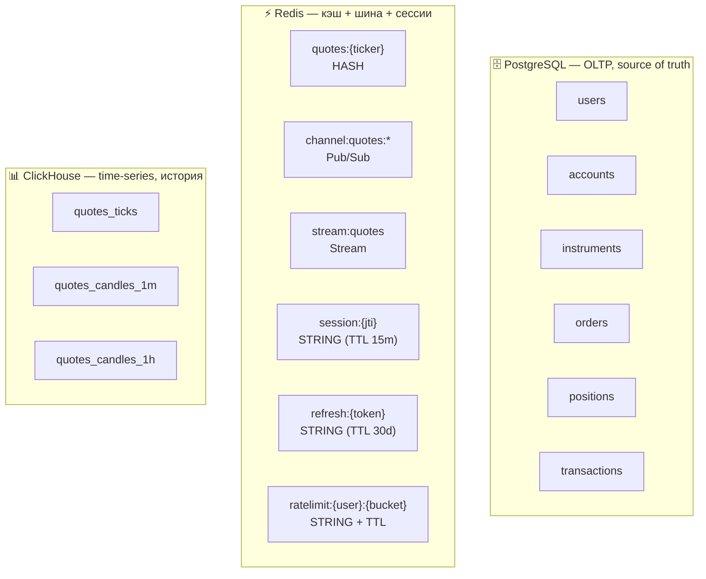
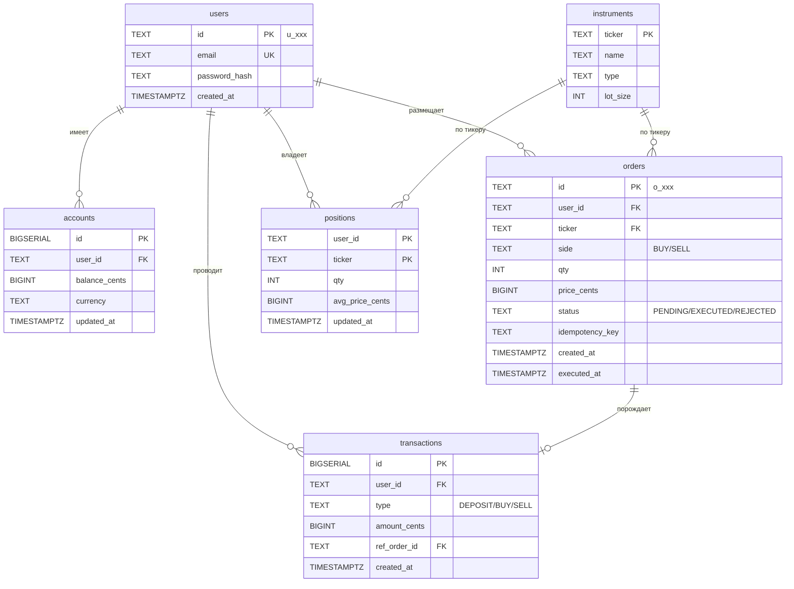

# 06. Архитектура данных

## Назначение

Описать **где какие данные хранятся**, как структурированы, как живут во времени и почему выбран именно такой бэкенд под каждый класс данных.

---

## 6.1. Карта данных по хранилищам



| Класс данных | Хранилище | Почему здесь |
|---|---|---|
| Деньги, ордера, портфели | PostgreSQL | ACID, голый SQL по ТЗ, реляционные связи |
| Каталог инструментов | PostgreSQL | редко меняется, нужен JOIN с ордерами |
| Текущие котировки | Redis HASH | sub-ms чтение, маленький объём (50 ключей) |
| Поток котировок (real-time) | Redis Pub/Sub | fanout без durability |
| Поток котировок (durable) | Redis Streams | для медленных потребителей |
| Сессии, refresh-токены | Redis с TTL | быстрая проверка, авто-expire |
| Rate-limiting счётчики | Redis с TTL | атомарный INCR |
| История тиков (для графиков) | ClickHouse | колоночное хранение, range-сканы |
| Свечи (агрегированные) | ClickHouse Materialized Views | предрасчёт для UI |

---

## 6.2. PostgreSQL: схема

### 6.2.1. Диаграмма



### 6.2.2. DDL

```sql
-- Пользователи
CREATE TABLE users (
    id              TEXT PRIMARY KEY,                    -- u_<ulid>
    email           TEXT UNIQUE NOT NULL,
    password_hash   TEXT NOT NULL,                       -- argon2
    created_at      TIMESTAMPTZ NOT NULL DEFAULT now()
);

-- Денежные счета
CREATE TABLE accounts (
    id              BIGSERIAL PRIMARY KEY,
    user_id         TEXT NOT NULL REFERENCES users(id),
    balance_cents   BIGINT NOT NULL DEFAULT 0,
    currency        TEXT NOT NULL DEFAULT 'RUB',
    updated_at      TIMESTAMPTZ NOT NULL DEFAULT now(),
    UNIQUE (user_id, currency)
);
CREATE INDEX idx_accounts_user ON accounts(user_id);

-- Каталог инструментов
CREATE TABLE instruments (
    ticker      TEXT PRIMARY KEY,
    name        TEXT NOT NULL,
    type        TEXT NOT NULL DEFAULT 'STOCK',
    lot_size    INT NOT NULL DEFAULT 1
);

-- Ордера
CREATE TABLE orders (
    id                  TEXT PRIMARY KEY,                -- o_<ulid>
    user_id             TEXT NOT NULL REFERENCES users(id),
    ticker              TEXT NOT NULL REFERENCES instruments(ticker),
    side                TEXT NOT NULL CHECK (side IN ('BUY','SELL')),
    qty                 INT NOT NULL CHECK (qty > 0),
    price_cents         BIGINT,                          -- NULL до исполнения
    status              TEXT NOT NULL CHECK (status IN ('PENDING','EXECUTED','REJECTED')),
    idempotency_key     TEXT,
    created_at          TIMESTAMPTZ NOT NULL DEFAULT now(),
    executed_at         TIMESTAMPTZ,
    UNIQUE (user_id, idempotency_key)
);
CREATE INDEX idx_orders_user_created ON orders(user_id, created_at DESC);
CREATE INDEX idx_orders_status ON orders(status) WHERE status = 'PENDING';

-- Позиции (по одной строке на (пользователь, тикер))
CREATE TABLE positions (
    user_id             TEXT NOT NULL REFERENCES users(id),
    ticker              TEXT NOT NULL REFERENCES instruments(ticker),
    qty                 INT NOT NULL DEFAULT 0,
    avg_price_cents     BIGINT NOT NULL DEFAULT 0,
    updated_at          TIMESTAMPTZ NOT NULL DEFAULT now(),
    PRIMARY KEY (user_id, ticker)
);

-- История денежных операций (audit trail)
CREATE TABLE transactions (
    id              BIGSERIAL PRIMARY KEY,
    user_id         TEXT NOT NULL REFERENCES users(id),
    type            TEXT NOT NULL CHECK (type IN ('DEPOSIT','BUY','SELL')),
    amount_cents    BIGINT NOT NULL,
    ref_order_id    TEXT REFERENCES orders(id),
    created_at      TIMESTAMPTZ NOT NULL DEFAULT now()
);
CREATE INDEX idx_txn_user ON transactions(user_id, created_at DESC);
```

### 6.2.3. Соглашения

- **Деньги хранятся в `BIGINT cents`** (не `NUMERIC`/`DECIMAL`) — быстрее, проще, без округления.
- **Идентификаторы пользовательских сущностей** — `TEXT` с префиксом (`u_`, `o_`) и ULID — сортируются по времени, безопасно показывать в API.
- **Времена** — всегда `TIMESTAMPTZ`, в UTC.
- **`updated_at`** — обновляется триггером (опционально) или явно в коде.
- **CHECK-констрейнты** на enum-полях вместо PostgreSQL-енумов (проще миграции).

### 6.2.4. Миграции

Используем **Flyway**. Все миграции в `core-service/src/main/resources/db/migration/V<N>__<name>.sql`.

```
V1__init_users_accounts.sql     # users, accounts
V2__instruments.sql             # каталог + сидинг 50 тикеров (см. seed/instruments-50.md)
V3__orders.sql
V4__positions.sql
V5__transactions.sql
V6__indexes_perf.sql            # idx_orders_user_ticker
V7__pg_stat_statements.sql      # CREATE EXTENSION + monitoring role (для exporter)
```

Подробности (Flyway-конфиг, CI-flow, seed для dev) — в [12. §12.1.4](12-storage-operations.md#1214-migrations--seeding-flyway). Список 50 тикеров — [seed/instruments-50.md](seed/instruments-50.md).

### 6.2.5. Партиционирование — НЕ в MVP

Heap-таблицы `orders` и `transactions` **не партиционируются** в MVP. Объёмы (см. §6.6) ниже порога рентабельности партиционирования; глобальные UNIQUE-индексы (см. ADR-005, ADR-007) важны и работают только на не-партиционированных таблицах. Решение зафиксировано в [ADR-008](adr/ADR-008-pg-no-partitioning-mvp.md), там же — точка эволюции.

ClickHouse-партиционирование `quotes_ticks` (§6.4.1) остаётся — это нативное и обязательное для MergeTree-TTL.

---

## 6.3. Redis: ключи и структуры

### 6.3.1. Соглашение об именовании

```
<namespace>:<entity>[:<id>]
```

Двоеточие как разделитель.

### 6.3.2. Ключи

| Ключ | Тип | TTL | Что хранит |
|---|---|---|---|
| `quotes:{ticker}` | HASH | — | last/bid/ask/ts/volume по инструменту |
| `channel:quotes:{ticker}` | Pub/Sub | — | поток тиков (push, без хранения) |
| `stream:quotes` | Stream | maxlen 100k | durable backup тиков |
| `session:{jti}` | STRING | 15 min | userId по JWT-id |
| `refresh:{token_id}` | STRING | 30 days | userId по refresh-token |
| `ratelimit:{userId}:{bucket}` | STRING | 60 s | счётчик RPS |
| `lock:order:{userId}` 📦 *backlog, не для MVP* | STRING (NX, EX) | 5 s | защита от двойного исполнения; в MVP не используем — хватает UNIQUE-индекса по idempotency-key |

### 6.3.3. Примеры команд

```
# Quotes Service публикует тик
HSET    quotes:SBER  ts "..."  bid 28550  ask 28570  last 28560  volume 12345
PUBLISH channel:quotes:SBER  '{"ts":"...","bid":285.50,...}'
XADD    stream:quotes  *  ticker SBER  ts ...  bid 28550  ask 28570  last 28560

# Core Service читает текущую цену для исполнения ордера
HGET    quotes:SBER  ask

# Gateway проверяет сессию
EXISTS  session:9c44b7e2...
```

### 6.3.4. Eviction policy

- maxmemory-policy: `allkeys-lru` для общего инстанса.
- Для production-like — отдельный инстанс под Pub/Sub без eviction.

---

## 6.4. ClickHouse: схема

### 6.4.1. Сырые тики

```sql
CREATE TABLE quotes_ticks (
    ticker      LowCardinality(String),
    ts          DateTime64(3, 'UTC'),
    bid         Decimal(18, 4),
    ask         Decimal(18, 4),
    last        Decimal(18, 4),
    volume      UInt64
)
ENGINE = MergeTree
PARTITION BY toYYYYMM(ts)
ORDER BY (ticker, ts)
TTL toStartOfMonth(ts) + INTERVAL 6 MONTH;
```

- `LowCardinality` — словарь для тикеров (их 50, не миллион).
- `PARTITION BY toYYYYMM` — удобно дропать старые партиции.
- `ORDER BY (ticker, ts)` — оптимизирует range-сканы по тикеру за период.
- `TTL` — автоматически удаляет тики старше 6 месяцев.

### 6.4.2. Агрегированные свечи (Materialized View)

Для графиков 1m/5m/1h не сканируем сырые тики — есть готовые свечи.

```sql
CREATE TABLE quotes_candles_1m (
    ticker      LowCardinality(String),
    ts_minute   DateTime,
    open        AggregateFunction(argMin, Decimal(18,4), DateTime64(3)),
    close       AggregateFunction(argMax, Decimal(18,4), DateTime64(3)),
    high        AggregateFunction(max,   Decimal(18,4)),
    low         AggregateFunction(min,   Decimal(18,4)),
    volume      AggregateFunction(sum,   UInt64)
)
ENGINE = AggregatingMergeTree
PARTITION BY toYYYYMM(ts_minute)
ORDER BY (ticker, ts_minute);

CREATE MATERIALIZED VIEW quotes_candles_1m_mv TO quotes_candles_1m AS
SELECT
    ticker,
    toStartOfMinute(ts) AS ts_minute,
    argMinState(last, ts) AS open,
    argMaxState(last, ts) AS close,
    maxState(last)  AS high,
    minState(last)  AS low,
    sumState(volume) AS volume
FROM quotes_ticks
GROUP BY ticker, ts_minute;
```

Аналогично для `quotes_candles_5m`, `quotes_candles_1h` (можно строить из 1m).

### 6.4.3. Запрос свечей для UI

```sql
SELECT
    ts_minute,
    argMinMerge(open)  AS open,
    argMaxMerge(close) AS close,
    maxMerge(high)     AS high,
    minMerge(low)      AS low,
    sumMerge(volume)   AS volume
FROM quotes_candles_1m
WHERE ticker = 'SBER'
  AND ts_minute BETWEEN '2026-05-09 00:00:00' AND '2026-05-09 23:59:00'
GROUP BY ts_minute
ORDER BY ts_minute;
```

---

## 6.5. Жизненный цикл данных (data lifecycle)

| Данные | Создание | Обновление | Удаление | Архивация |
|---|---|---|---|---|
| Пользователь | при регистрации | редко (смена пароля) | soft delete (флаг) | — |
| Аккаунт | при регистрации | при каждом ордере | вместе с пользователем | — |
| Инструмент | при сидинге | редко | никогда (для целостности FK) | — |
| Ордер | при размещении | при исполнении | никогда (audit) | без партиционирования в MVP, см. [ADR-008](adr/ADR-008-pg-no-partitioning-mvp.md) |
| Позиция | при первой покупке | при каждой сделке | при qty=0 (опционально) | — |
| Транзакция | при сделке | никогда | никогда (audit) | без партиционирования в MVP, см. [ADR-008](adr/ADR-008-pg-no-partitioning-mvp.md) |
| Сырой тик | в реальном времени | никогда | TTL 6 месяцев | дамп раз в год |
| Свеча | агрегацией | непрерывно (MV) | TTL вместе с тиками | — |
| Сессия | при login | при refresh | по TTL | — |

---

## 6.6. Объёмы хранилищ

Расчёт с учётом **TTL = 6 месяцев** на тики и одного года жизни системы для остальных таблиц.

| Класс | Кол-во записей | Размер на запись | Итого |
|---|---|---|---|
| users | 10 000 | 200 B | 2 MB |
| orders (за год) | 10к × 1/день × 365 = 3.6М | 300 B | ~1 GB |
| transactions (за год) | ~3.6М | 200 B | ~700 MB |
| positions | 10к × 5 тикеров = 50к | 100 B | 5 MB |
| quotes_ticks (за 6 месяцев, TTL) | 50 тикеров × 86400 × 180 = ~780М | 80 B | **~60 GB** raw, **~15 GB** ClickHouse-compressed |
| candles_1m (за 6 месяцев) | 50 × 262800 = 13М | 100 B | ~1.3 GB |

**Главный потребитель** — сырые тики в ClickHouse. Контролируется TTL (`toStartOfMonth(ts) + INTERVAL 6 MONTH`) и LZ4-компрессией.

Если хочется поднять retention до года — умножить ClickHouse-объём на 2 (~30 GB), всё ещё помещается в одну VM.

---

## 6.7. Бэкапы и восстановление

### MVP-уровень

| Что | Стратегия |
|---|---|
| PostgreSQL | `pg_dump` раз в сутки на хост, в `volumes/backups/` |
| ClickHouse | необязательно (тики восстановимы из stream:quotes за последний час, остальное некритично) |
| Redis | RDB-снапшоты раз в час (встроено) |

### Prod-like

- PG: streaming replication + WAL archiving в S3-совместимое хранилище.
- CH: replication через ZooKeeper.
- Redis: AOF + кластер.

Для учебного MVP — достаточно `pg_dump` в cron.

---

## 6.8. Обоснование выбора хранилищ

| Альтернатива | Почему НЕ выбрали |
|---|---|
| Всё в PostgreSQL (включая тики) | TimescaleDB справился бы, но ClickHouse требуется ТЗ; и колоночное хранение всё равно эффективнее на range-сканах |
| MongoDB вместо PostgreSQL | Деньги — это всегда ACID и реляционные констрейнты; документ-БД тут антипаттерн |
| Kafka вместо Redis Pub/Sub | Kafka мощнее, но сложнее в эксплуатации; брокер сообщений по ТЗ — Redis/KeyDB |
| InfluxDB | Не в стеке ТЗ |
| Cassandra для тиков | overkill для MVP, нет нужного оператора |

---

## Связанные документы

- ⬅ [05. Коммуникация и API](05-communication.md)
- ➡ [07. Согласованность и транзакции](07-consistency.md)
- ➡ [08. Масштабирование и производительность](08-scaling.md)
- ➡ [12. Эксплуатация уровня хранения](12-storage-operations.md) — конфиги, пулы, health, бэкапы.
- 📎 [seed/instruments-50.md](seed/instruments-50.md) — список 50 тикеров для V2 миграции.
