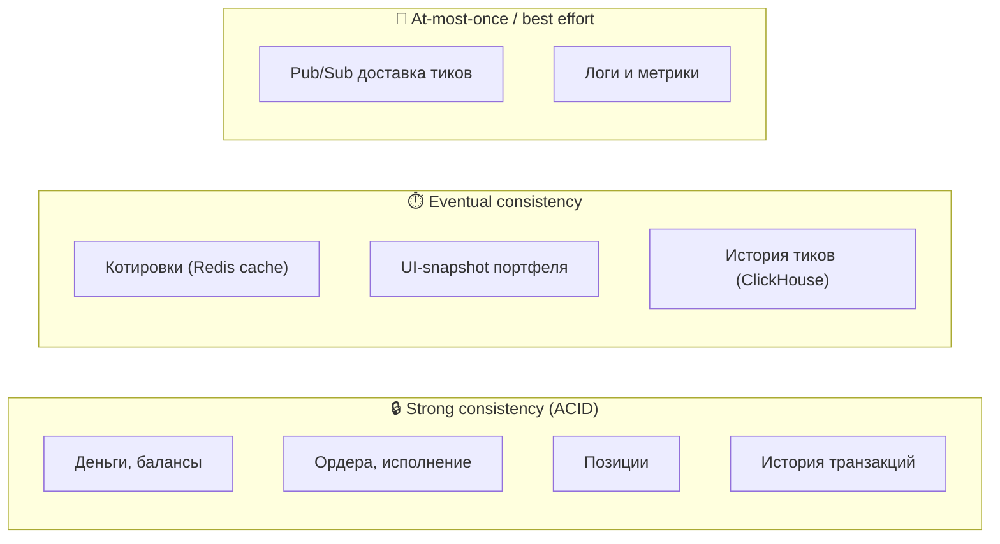
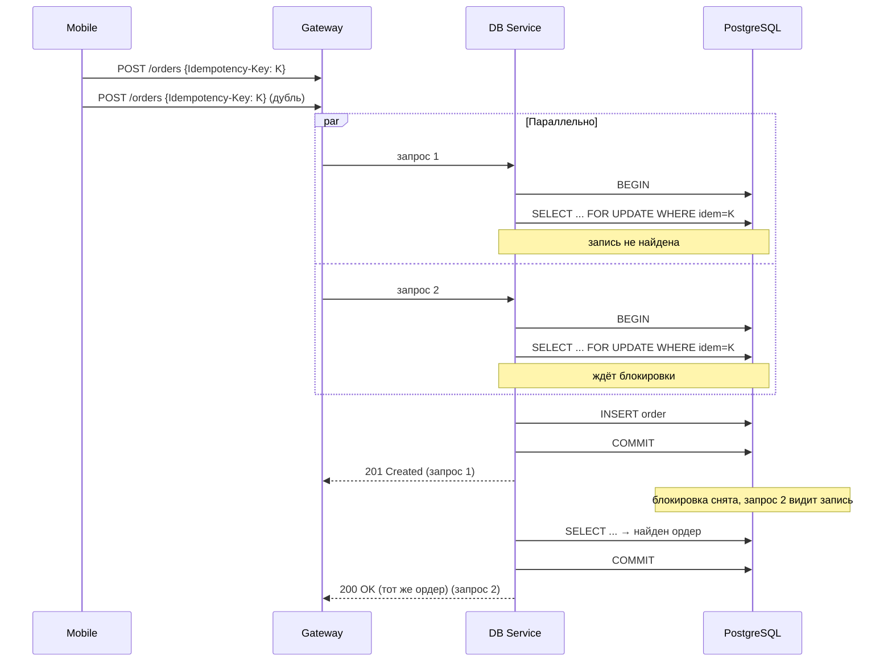

# 07. Согласованность и транзакции

## Назначение

Описать **гарантии согласованности данных** и работу с транзакциями: где нужен строгий ACID, где допустима eventual consistency, как обеспечивается идемпотентность и как обрабатываются конкурентные операции.

---

## 7.1. Карта гарантий



| Класс данных | Гарантия | Хранилище | Обоснование |
|---|---|---|---|
| Балансы, ордера, позиции | **ACID** | PostgreSQL | Финансовые операции, нельзя терять/двоить |
| История транзакций | **ACID** | PostgreSQL | Audit trail |
| Текущая котировка | **eventual** | Redis HASH | Если тик устареет на 100 мс — приемлемо |
| Поток котировок (push) | **at-most-once** | Redis Pub/Sub | Дубль/потеря тика не критичны |
| История тиков | **eventual** | ClickHouse | Батчевая запись с задержкой ~1 сек |
| Сессии, JWT | **eventual** | Redis с TTL | Auto-expiration приемлем |

---

## 7.2. ACID-транзакции в PostgreSQL

### 7.2.1. Где нужны

Все операции, изменяющие **деньги** или **позиции**:
- Размещение ордера (BUY/SELL).
- Депозит на счёт (фиктивный, при регистрации).
- Любая комбинация изменений баланса и позиции.

### 7.2.2. Изоляция

Используем **READ COMMITTED** (default в PostgreSQL) + явные блокировки там, где нужно.

Почему не Serializable: на 10к concurrent даёт неприемлемо высокий процент сериализационных откатов. READ COMMITTED + `SELECT ... FOR UPDATE` достаточно для наших инвариантов.

### 7.2.3. Транзакция «Размещение и исполнение ордера BUY»

```sql
BEGIN;

-- 1. Идемпотентность: если ордер с таким ключом уже есть — вернуть его
SELECT id, status FROM orders
WHERE user_id = $1 AND idempotency_key = $2
FOR UPDATE;
-- если нашли — выходим, отдаём существующий

-- 2. Получаем текущую цену из Redis (вне TX, в коде)
-- ... HGET quotes:SBER ask  → 28570 (cents)

-- 3. Блокируем строку счёта пользователя
SELECT balance_cents FROM accounts
WHERE user_id = $1 AND currency = 'RUB'
FOR UPDATE;

-- 4. Проверяем баланс. Стоимость = qty * price
-- если balance < cost → INSERT order (status=REJECTED) и COMMIT

-- 5. Списываем деньги
UPDATE accounts
SET balance_cents = balance_cents - $cost,
    updated_at = now()
WHERE user_id = $1 AND currency = 'RUB';

-- 6. Upsert позицию (атомарное обновление средней цены)
INSERT INTO positions (user_id, ticker, qty, avg_price_cents)
VALUES ($1, $ticker, $qty, $price)
ON CONFLICT (user_id, ticker) DO UPDATE
SET qty = positions.qty + EXCLUDED.qty,
    avg_price_cents = (
        positions.avg_price_cents * positions.qty + EXCLUDED.avg_price_cents * EXCLUDED.qty
    ) / (positions.qty + EXCLUDED.qty),
    updated_at = now();

-- 7. Создаём ордер
INSERT INTO orders (id, user_id, ticker, side, qty, price_cents, status, idempotency_key, executed_at)
VALUES ($oid, $1, $ticker, 'BUY', $qty, $price, 'EXECUTED', $idem, now());

-- 8. Запись в audit log
INSERT INTO transactions (user_id, type, amount_cents, ref_order_id)
VALUES ($1, 'BUY', -$cost, $oid);

COMMIT;
```

**Ключевые моменты:**
- `FOR UPDATE` на `accounts` — блокирует строку до COMMIT, чтобы конкурентные ордера не тратили один и тот же баланс.
- Цена берётся из Redis **до** транзакции, чтобы не держать TX открытой во время сетевого вызова.
- `ON CONFLICT DO UPDATE` для позиции — атомарный upsert, не нужен SELECT-then-UPDATE.

### 7.2.4. Транзакция «Размещение и исполнение ордера SELL»

```sql
BEGIN;

-- 1. Идемпотентность: тот же UNIQUE-индекс, что и для BUY
SELECT id, status FROM orders
WHERE user_id = $1 AND idempotency_key = $2
FOR UPDATE;
-- если нашли — выходим, отдаём существующий

-- 2. Цена для SELL — текущий bid (получаем из Redis вне TX)
-- HGET quotes:SBER bid → 28550 (cents)

-- 3. Блокируем строку позиции
SELECT qty FROM positions
WHERE user_id = $1 AND ticker = $ticker
FOR UPDATE;

-- 4. Проверяем количество
-- если qty < $qty_to_sell → INSERT order (status=REJECTED) и COMMIT

-- 5. Уменьшаем позицию (avg_price НЕ меняется при продаже)
UPDATE positions
SET qty = qty - $qty,
    updated_at = now()
WHERE user_id = $1 AND ticker = $ticker;

-- 6. Зачисляем выручку = qty * bid
UPDATE accounts
SET balance_cents = balance_cents + $proceeds,
    updated_at = now()
WHERE user_id = $1 AND currency = 'RUB';

-- 7. Создаём ордер
INSERT INTO orders (id, user_id, ticker, side, qty, price_cents, status, idempotency_key, executed_at)
VALUES ($oid, $1, $ticker, 'SELL', $qty, $price, 'EXECUTED', $idem, now());

-- 8. Audit-запись (положительная сумма — приход)
INSERT INTO transactions (user_id, type, amount_cents, ref_order_id)
VALUES ($1, 'SELL', +$proceeds, $oid);

COMMIT;
```

**Отличия от BUY:**
- Цена берётся как `bid`, а не `ask` (продаём по цене покупателя).
- Блокируется строка `positions`, а не `accounts` (баланс пополняется, а не списывается).
- `avg_price_cents` **не меняется** — у позиции остаётся старая средняя цена покупки. Поэтому используется обычный `UPDATE`, а не `INSERT ... ON CONFLICT`.
- Сумма в `transactions.amount_cents` — **положительная** (приход на счёт).

**Опционально:** при `qty - $qty = 0` можно делать `DELETE FROM positions` вместо UPDATE — но в MVP оставляем строку, чтобы не плодить INSERT/DELETE.

---

## 7.3. Идемпотентность

### 7.3.1. Зачем

Мобильный клиент может ретраить запрос (плохая сеть, таймаут). Без идемпотентности один тап «купить» может списать деньги дважды.

### 7.3.2. Реализация: Idempotency-Key

**Контракт:**
- Клиент генерирует UUID/ULID на каждое действие пользователя.
- Шлёт в заголовке `Idempotency-Key: <uuid>`.
- Сервер при первом запросе создаёт ордер и **сохраняет ключ**.
- При повторе с тем же ключом — возвращает **тот же** ответ, не создавая ордер.

**Уникальный индекс в БД:**
```sql
UNIQUE (user_id, idempotency_key)
```

Если попытка вставить дубль — ловим `unique_violation`, читаем существующий ордер, отдаём его клиенту.

### 7.3.3. TTL ключей

В PostgreSQL ключ хранится постоянно (вместе с ордером). На фронте — может быть TTL 24 ч (после этого новый ключ).

---

## 7.4. Конкурентные операции

### 7.4.1. Двойной клик «Купить»



### 7.4.2. Гонка за баланс при недостатке средств

Два ордера от одного пользователя одновременно, баланс хватает на один.

`SELECT ... FOR UPDATE` на строке `accounts` сериализует их: первый успевает COMMIT, второй после получения блокировки видит уменьшенный баланс и REJECT-ит ордер.

### 7.4.3. Распределённая блокировка 📦 Backlog (не для MVP)

Для дополнительной защиты от двойного исполнения (если TX откатывается из-за timeout):

```
SET lock:order:{userId}  1  NX  EX 5
```

В **MVP не используем**: уникальный индекс по `(user_id, idempotency_key)` уже даёт нужные гарантии (см. [ADR-005](adr/ADR-005-idempotency-key.md)). Описано здесь только как точка эволюции при росте нагрузки.

---

## 7.5. Eventual consistency: котировки

### 7.5.1. Почему допустимо

- Тик котировки меняется десятки раз в секунду.
- Если клиент увидит цену с задержкой 50–500 мс — это **штатная ситуация** для любого торгового приложения.
- Цена для **исполнения** ордера берётся в момент исполнения (свежая из Redis), а не та, которую видел клиент в UI.

### 7.5.2. Контракт «цена исполнения»

В UI и API явно различаем:
- `lastQuotedPrice` — последняя цена, которую видел клиент (информационная).
- `executionPrice` — цена, по которой реально исполнен ордер (фиксируется в момент исполнения).

Это аналог поведения реальных бирж и решает проблему «цена прыгнула за миллисекунду».

### 7.5.3. Правило отображения 📦 Backlog

> Slippage-проверка не реализуется в MVP — мобильный клиент в текущем API не передаёт ожидаемую цену в `POST /orders`, поэтому сравнивать не с чем. Описано как точка развития.

В будущем, если разница `executionPrice − lastQuotedPrice` > 5%, можно отклонять ордер с кодом `PRICE_SLIPPAGE`.

---

## 7.6. At-most-once: Pub/Sub

### 7.6.1. Контракт

- Quotes Service публикует тики **fire-and-forget** в `channel:quotes:*`.
- Если Gateway отвалился на момент публикации — этот тик потерян для подписчиков, **следующий придёт через ~1 сек**.
- ClickHouse и `stream:quotes` — durable backup; критичные потребители (графики, аналитика) читают оттуда.

### 7.6.2. Восстановление после reconnect

Когда Gateway перезапускается, он:
1. Подписывается на `channel:quotes:*`.
2. Для каждого подписанного клиента шлёт текущий snapshot из `quotes:{ticker}` (HGET).
3. Дальше идут live-тики.

Клиент видит небольшой gap (<1 сек), но не нуждается в догоне «каждого пропущенного тика».

---

## 7.7. Транзакционная граница vs распределённая транзакция

### Принцип

Все денежно-значимые операции укладываются в **одну транзакцию PostgreSQL**.
Никаких распределённых транзакций (XA, 2PC), никаких saga.

### Почему получается

| Шаг операции | Где живёт |
|---|---|
| Чтение цены | Redis (вне TX, до старта) |
| Проверка баланса | PostgreSQL |
| Списание/начисление | PostgreSQL |
| Создание ордера | PostgreSQL |
| Обновление позиции | PostgreSQL |
| Audit-запись | PostgreSQL |

Все мутации — в одной БД, в одной TX. Если что-то упало — `ROLLBACK`, состояние согласовано.

Redis-операции (HGET для цены) — **read-only**, их откатывать не нужно.
Котировки в Pub/Sub — отдельный поток, не связан с транзакцией ордера.

---

## 7.8. Outbox pattern 📦 Backlog (не для MVP)

Если в будущем понадобится отправлять события наружу (например, push-уведомления при исполнении), используем **Outbox**:

```sql
INSERT INTO outbox (event_type, payload, created_at)
VALUES ('order.executed', '{...}', now());
```

Воркер читает `outbox` и публикует события в Kafka/Redis. Гарантирует «событие отправлено ровно тогда, когда транзакция закоммичена».

В MVP не используется.

---

## 7.9. Правила, которые легко нарушить (антипаттерны)

| ❌ Нельзя | ✅ Правильно |
|---|---|
| Делать `HGET` Redis **внутри** TX PostgreSQL | Сначала прочитать цену, потом BEGIN |
| Обновлять баланс без `FOR UPDATE` | Всегда блокировать строку перед UPDATE |
| Полагаться на `BIGINT` арифметику без проверки overflow | Проверять `balance >= cost` явно |
| Использовать `NUMERIC` для денег | `BIGINT cents` — быстрее и проще |
| Хранить пароли в открытом виде | argon2/bcrypt + соль |
| Возвращать ошибку без отката TX | Всегда `try/catch` с `ROLLBACK` |
| Делать длинные TX (> 1 сек) | Подготовить данные снаружи, TX держать миллисекунды |

---

## 7.10. Тесты на согласованность

В разделе [тестирования отчёта](../../REQUIREMENTS.md) — используем integration-тесты, которые гоняют:
- 100 параллельных BUY от одного пользователя на ордер, перекрывающий баланс ровно один раз → ровно один EXECUTED, остальные REJECTED.
- 1000 параллельных BUY с одинаковым `Idempotency-Key` → ровно один ордер в БД.
- Проверка инвариантов после прогона имитатора:
  - `SUM(transactions.amount) = balance - initial_deposit` для каждого пользователя.
  - `SUM(positions.qty * avg_price)` совпадает с прохождением через ордера.

---

## Связанные документы

- ⬅ [06. Архитектура данных](06-data.md)
- ➡ [08. Масштабирование и производительность](08-scaling.md)
- ➡ [10. Ключевые сценарии](10-scenarios.md)
