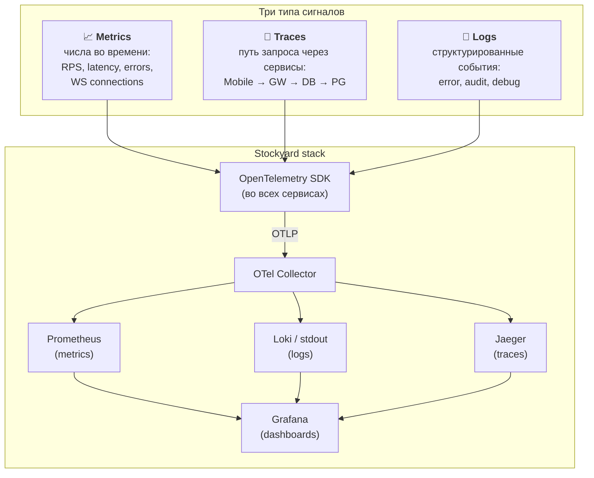

# 09. Наблюдаемость

## Назначение

Описать, **что и как мы наблюдаем** в работающей системе: метрики, трейсы, логи; как они собираются, где хранятся и какие SLI/SLO на их основе формируются. По требованию ТЗ — Open Telemetry.

> ### 🎯 MVP must-have vs 📦 Backlog
>
> - 🎯 **MVP:** OTel SDK во всех сервисах, Prometheus + Jaeger + Grafana, RED-метрики, базовые бизнес-метрики `stockyard_*`, дашборды (§9.7), чек-лист для отчёта (§9.11).
> - 📦 **Backlog:** Loki для логов, tail-based sampling, alerting в Slack/Telegram (§9.8). Логи в MVP читаем через `docker logs`.

---

## 9.1. Три столпа observability



---

## 9.2. OpenTelemetry: единый стандарт

Все сервисы используют **OpenTelemetry SDK** — это требование ТЗ.

| Сервис | SDK | Что инструментировано |
|---|---|---|
| API Gateway (Kotlin) | `io.opentelemetry:opentelemetry-sdk` + Ktor instrumentation | HTTP routes, WS, исходящие HTTP, Redis ops |
| Core Service (Kotlin) | то же | HTTP, JDBC, Redis, ClickHouse |
| Quotes Service (Go) | `go.opentelemetry.io/otel` | driver reads, Redis ops, ClickHouse inserts |
| Load Simulator | то же | для отчёта о тесте |

### Конвенция атрибутов (OTel semantic conventions)

```
service.name        = "api-gateway" / "core-service" / "quotes-service"
service.version     = "0.1.0"
service.instance.id = uuid (на каждый запуск)
deployment.environment = "dev" / "demo" / "prod"
```

Кастомные атрибуты на трейсах:
```
stockyard.user_id    = "u_abc123"
stockyard.order_id   = "o_xyz789"
stockyard.ticker     = "SBER"
stockyard.idempotency_key = "..."
```

---

## 9.3. Метрики (Metrics)

### 9.3.1. Стандартные группы

#### RED для каждого сервиса (Rate / Errors / Duration)

| Метрика | Тип | Лейблы |
|---|---|---|
| `http_requests_total` | counter | `service`, `route`, `method`, `status` |
| `http_request_duration_seconds` | histogram | `service`, `route`, `method` |
| `http_errors_total` | counter | `service`, `route`, `error_class` |

#### USE для инфры (Utilization / Saturation / Errors)

| Метрика | Где |
|---|---|
| `process_cpu_usage` | каждый сервис |
| `jvm_memory_used_bytes` | Kotlin-сервисы |
| `jvm_gc_pause_seconds` | Kotlin-сервисы |
| `go_memstats_alloc_bytes` | Quotes Service |
| `pg_connections_active` / `pg_connections_max` | PostgreSQL exporter |

### 9.3.2. Бизнес-метрики Stockyard

| Метрика | Тип | Описание |
|---|---|---|
| `stockyard_ws_connections` | gauge (per-instance) | текущее число открытых WS |
| `stockyard_ws_messages_sent_total` | counter | отправлено тиков клиентам |
| `stockyard_ws_messages_dropped_total` | counter | дропнуто из-за backpressure |
| `stockyard_orders_placed_total` | counter (`status`, `side`) | размещено ордеров |
| `stockyard_orders_duration_seconds` | histogram (`side`) | время от POST /orders до ответа |
| `stockyard_quotes_published_total` | counter (`ticker`) | опубликовано тиков в Pub/Sub |
| `stockyard_quotes_lag_seconds` | gauge (`ticker`) | возраст последнего тика |
| `stockyard_driver_read_errors_total` | counter | ошибок чтения из драйвера |
| `stockyard_clickhouse_batch_size` | histogram | размер батча в ClickHouse |
| `stockyard_login_failures_total` | counter | неудачных логинов (для security) |

### 9.3.3. Golden Signals по Google SRE

Для каждого user-facing endpoint:
- **Latency** — `http_request_duration_seconds{route="/orders"}`
- **Traffic** — `rate(http_requests_total{route="/orders"}[1m])`
- **Errors** — `rate(http_requests_total{route="/orders",status=~"5.."}[1m])`
- **Saturation** — `process_cpu_usage`, `pg_connections_active / pg_connections_max`

---

## 9.4. Трейсинг (Traces)

### 9.4.1. Что хотим увидеть

Полный путь одного бизнес-действия:

```
[trace_id: abc123]
└── HTTP POST /orders (api-gateway)               240ms
    ├── jwt.verify                                  2ms
    ├── ratelimit.check                             1ms
    └── HTTP POST /internal/orders (core-service)   220ms
        ├── auth.lookup                             5ms
        ├── HGET quotes:SBER (redis)                3ms
        ├── tx.begin                                1ms
        ├── SELECT ... FOR UPDATE accounts         15ms
        ├── INSERT orders                           8ms
        ├── INSERT positions / UPDATE              10ms
        ├── INSERT transactions                     6ms
        └── tx.commit                              12ms
```

### 9.4.2. Sampling

Для prod: `parentbased_traceidratio` 1–10%.
Для dev/demo: 100%.

Опция: **tail-based sampling** в OTel Collector — собирать **все** трейсы, у которых есть errors или duration > p99. В MVP — head-based, проще.

### 9.4.3. Context propagation

- HTTP: заголовок `traceparent` (W3C Trace Context).
- Redis: явный wrapper в коде (Redis сам не пробрасывает контекст).
- WebSocket: каждое получение тика создаёт **новый** span (это не один длинный trace, а тысячи коротких).

### 9.4.4. Что обязательно в каждом трейсе

- `service.name`
- `http.method`, `http.route`, `http.status_code`
- `user.id` (если аутентифицирован)
- `error` = true + `exception.message` при ошибке

---

## 9.5. Логи (Logs)

### 9.5.1. Формат: structured JSON

```json
{
  "ts": "2026-05-09T12:34:56.789Z",
  "level": "INFO",
  "logger": "com.stockyard.db.OrderService",
  "msg": "order executed",
  "trace_id": "abc123...",
  "span_id": "def456...",
  "service.name": "core-service",
  "user.id": "u_abc123",
  "order.id": "o_xyz789",
  "order.side": "BUY",
  "order.qty": 10,
  "order.price": 285.70
}
```

### 9.5.2. Уровни и правила

| Уровень | Когда |
|---|---|
| ERROR | Необработанные исключения, downstream недоступен, нарушение инвариантов |
| WARN | Восстановимые ошибки, retries, ratelimits, INSUFFICIENT_FUNDS |
| INFO | Бизнес-события: login, order placed, order executed |
| DEBUG | Только локально/dev — детали SQL, payloads |
| TRACE | Никогда не в prod |

### 9.5.3. Чего НЕ логируем

- Пароли (никогда).
- JWT-токены полностью (только первые 8 символов с маскировкой).
- Полные payloads с PII.

### 9.5.4. Корреляция с трейсами

Каждая запись лога содержит `trace_id` и `span_id`. В Grafana кликаем на лог → переходим в трейс.

---

## 9.6. SLI и SLO

### 9.6.1. SLI (Service Level Indicators)

Конкретные измеримые показатели.

| SLI | Формула |
|---|---|
| Доступность POST /orders | `1 - rate(5xx) / rate(total)` |
| Latency p95 POST /orders | гистограмма `http_request_duration_seconds{route="/orders"}` |
| WS-доставка тиков | `1 - rate(ws_messages_dropped) / rate(ws_messages_sent)` |
| Свежесть котировок | `quotes_lag_seconds < 1` |
| Успешность логинов | `1 - rate(login_failures) / rate(login_attempts)` (с учётом честных ошибок) |

### 9.6.2. SLO (Service Level Objectives)

Цели на SLI, формализуют контракт.

| Сервис | SLO |
|---|---|
| Order placement availability | 99.0% за 30 дней |
| Order placement latency p95 | < 300 мс |
| Quote freshness | 99% тиков моложе 1 секунды |
| WS delivery | 99% сообщений доставлены без drop |

### 9.6.3. Error budget

При SLO 99% за 30 дней допустимо **7.2 часа** простоя/деградации в месяц.
Когда error budget сожжён — стоп новым фичам, чиним основу. (Для учебного MVP — формальное правило.)

---

## 9.7. Дашборды Grafana

### Что должно быть к сдаче

| Дашборд | Содержание |
|---|---|
| **Stockyard Overview** | RPS, latency p50/p95/p99, error rate по всем сервисам, число WS, ордеров/сек |
| **API Gateway** | WS connections, входящий RPS по route, JWT verify time, downstream errors |
| **Core Service** | TPS PostgreSQL, latency по эндпоинтам, размер пула соединений, ордеров EXECUTED/REJECTED |
| **Quotes Pipeline** | tick rate из драйвера, lag в Redis, размер батчей в ClickHouse, ошибки |
| **Infrastructure** | CPU/RAM/Disk хостов, Redis hit rate, PG locks, ClickHouse merges |
| **Business** | DAU, активные пользователи сейчас, ордеров/сутки, объёмы по тикерам |

JSON-определения дашбордов — в `deploy/grafana/dashboards/`.

---

## 9.8. Алерты 📦 Backlog (не для MVP)

> Не реализуется в MVP — для учебного проекта алерты проверяются вручную по дашбордам Grafana. Описано как точка эволюции.

Если делаем — минимум:

| Alert | Условие | Severity |
|---|---|---|
| HighErrorRate | `5xx rate > 5% за 5 мин` | critical |
| HighLatency | `p95 /orders > 1s за 5 мин` | warning |
| QuoteLag | `quotes_lag_seconds > 10` | warning |
| DriverDown | `quotes_published_rate == 0 за 30 сек` | critical |
| PGConnectionsHigh | `pg_connections_active / max > 80%` | warning |
| HighGCPause | `jvm_gc_pause p95 > 500ms` | warning |

Доставка — Telegram/Slack-вебхук. Для учебного MVP — Grafana → email.

---

## 9.9. Стек observability в развёртывании

Из [04. Deployment](04-deployment.md):

```
┌────────────────────────────────────────┐
│  Сервисы (с OTel SDK)                  │
└──────────────────┬─────────────────────┘
                   │ OTLP/gRPC
                   ▼
┌────────────────────────────────────────┐
│  OpenTelemetry Collector               │
│  - receivers: otlp                     │
│  - processors: batch, memory_limiter   │
│  - exporters: prometheus, jaeger, loki │
└─────┬─────────────┬────────────┬───────┘
      │             │            │
      ▼             ▼            ▼
┌──────────┐  ┌──────────┐  ┌────────┐
│Prometheus│  │  Jaeger  │  │  Loki  │
└─────┬────┘  └────┬─────┘  └────┬───┘
      └────────────┼─────────────┘
                   ▼
           ┌─────────────┐
           │   Grafana   │
           └─────────────┘
```

---

## 9.10. Минимальный пример инструментации

### Kotlin (Ktor)

```kotlin
// Application.kt
fun Application.module() {
    install(OpenTelemetryKtor) {
        // tracing для всех routes автоматически
    }

    install(MicrometerMetrics) {
        registry = otelMeterRegistry
        meterBinders = listOf(
            JvmMemoryMetrics(), JvmGcMetrics(), ProcessorMetrics()
        )
    }

    routing {
        post("/orders") {
            val span = tracer.spanBuilder("place_order")
                .setAttribute("user.id", call.userId)
                .startSpan()
            try {
                ordersCounter.increment(Tags.of("side", req.side))
                // ... бизнес-логика
            } finally {
                span.end()
            }
        }
    }
}
```

### Go (Quotes Service)

```go
ctx, span := tracer.Start(ctx, "publish_tick",
    trace.WithAttributes(attribute.String("ticker", tick.Ticker)),
)
defer span.End()

quotesPublished.With(prometheus.Labels{"ticker": tick.Ticker}).Inc()

if err := redis.Publish(ctx, channel, payload).Err(); err != nil {
    span.RecordError(err)
    publishErrors.Inc()
    return err
}
```

---

## 9.11. Чек-лист для отчёта

В разделе «Тестирование» отчёта приводим:

- [ ] Скриншот дашборда **Stockyard Overview** под нагрузкой 10к CCU.
- [ ] Latency p95/p99 по `/orders` — в табличной форме.
- [ ] Error rate за 10-минутный прогон.
- [ ] Один пример end-to-end трейса (скриншот Jaeger).
- [ ] Сводка SLI vs SLO — какие выполнены, какие нет.

---

## 9.12. Storage instrumentation

Общая OTel-конфигурация описана в §9.2–§9.10. Здесь — конкретика для **storage layer**: какими SDK инструментируются три хранилища, какие span-attributes навешиваются и какие Prometheus-exporter'ы рядом стоят. Cross-link: операционные параметры самих хранилищ — в [12. Эксплуатация уровня хранения](12-storage-operations.md).

### 9.12.1. PostgreSQL (JDBC) — Kotlin-сервисы

Используем **OpenTelemetry Java Agent** (`opentelemetry-javaagent.jar`) — auto-instrumentation, ноль кода. Подключение через `JAVA_TOOL_OPTIONS=-javaagent:/otel.jar` в Dockerfile сервиса. Альтернатива — точечный модуль `opentelemetry-jdbc` (instrumentation library); финальный выбор делается на этапе backend по результатам замера CPU overhead.

Span создаётся на каждый JDBC statement. Semantic conventions:

| Attribute | Пример | Источник |
|---|---|---|
| `db.system` | `postgresql` | agent |
| `db.name` | `stockyard` | agent |
| `db.user` | `stockyard` | agent |
| `db.statement` | `INSERT INTO orders (...) VALUES (?, ...)` (sanitized — параметры не утекают) | agent |
| `db.operation` | `INSERT` / `SELECT` / `UPDATE` | agent |
| `db.sql.table` | `orders` | agent |
| `net.peer.name` | `postgres` | agent |

Кастомные **Stockyard**-атрибуты добавляются вручную на уровне business-span вокруг транзакции:

```
stockyard.tx.kind         = "order_buy" | "order_sell" | "deposit"
stockyard.user_id         = "u_..."
stockyard.order_id        = "o_..."
stockyard.idempotency_key = "..."
db.rows_affected          = 1
```

HikariCP-метрики экспортируются через **Micrometer → OTLP**:

| Метрика | Тип |
|---|---|
| `hikaricp.connections` | gauge — общее количество |
| `hikaricp.connections.active` | gauge — выданные сейчас |
| `hikaricp.connections.idle` | gauge — свободные |
| `hikaricp.connections.pending` | gauge — ожидающие выдачи (saturation signal) |
| `hikaricp.connections.usage` | timer — длительность hold |
| `hikaricp.connections.acquire` | timer — время ожидания соединения |
| `hikaricp.connections.creation` | timer — время создания |
| `hikaricp.connections.timeout` | counter — таймауты получения |

### 9.12.2. Redis (Kotlin: Lettuce)

Lettuce использует Micrometer `Observation API`, который мост-ит в OTel:

```kotlin
io.lettuce.core.tracing.MicrometerTracing(observationRegistry)
```

Атрибуты на span:

| Attribute | Пример |
|---|---|
| `db.system` | `redis` |
| `db.operation` | `HGET` / `PUBLISH` / `XADD` |
| `db.redis.database_index` | `0` |
| `net.peer.name` | `redis` |
| `db.statement` | `HGET quotes:SBER ask` (без значений) |

### 9.12.3. Redis (Go: go-redis) — Quotes Service

Готовая библиотека `github.com/redis/go-redis/extra/redisotel/v9`:

```go
if err := redisotel.InstrumentTracing(rdb); err != nil { return err }
if err := redisotel.InstrumentMetrics(rdb); err != nil { return err }
```

Атрибуты — те же `db.system=redis`, `db.operation`, `db.redis.database_index`. Метрики `go_redis_requests_total`, `go_redis_request_duration_seconds`, pool-stats (`go_redis_pool_*`).

### 9.12.4. ClickHouse (Go: clickhouse-go) — Quotes Service

Официальной OTel-обёртки нет → пишем ручной wrapper. Каждый `INSERT batch` оборачиваем в span:

| Attribute | Пример |
|---|---|
| `db.system` | `clickhouse` |
| `db.name` | `stockyard` |
| `db.operation` | `INSERT` / `SELECT` |
| `db.sql.table` | `quotes_ticks` |
| `stockyard.batch.rows` | `1000` |
| `stockyard.batch.bytes` | `~80000` |
| `stockyard.batch.flush_reason` | `full` / `timeout` |

Дополнения к существующему `stockyard_clickhouse_batch_size`:

| Метрика | Тип | Лейблы |
|---|---|---|
| `stockyard_clickhouse_batch_size` (есть) | histogram | — |
| `stockyard_clickhouse_batch_duration_seconds` | histogram | — |
| `stockyard_clickhouse_insert_errors_total` | counter | `error_class` |
| `stockyard_clickhouse_dropped_rows_total` | counter | `reason` |

### 9.12.5. ClickHouse (Kotlin: clickhouse-jdbc) — Core Service

Запросы свечей идут через clickhouse-jdbc и автоматически инструментируются OTel Java Agent (драйвер распознаётся как JDBC). Если spans не появляются — fallback на ручной wrapper вокруг `Statement.executeQuery`.

### 9.12.6. Storage exporters → Prometheus

Полный список — в [12-storage-operations §12.5](12-storage-operations.md#125-storage-exporters--prometheus). Ключевые метрики:

| Источник | Endpoint | Что снимаем |
|---|---|---|
| `postgres_exporter` | `:9187/metrics` | `pg_up`, `pg_database_size_bytes`, `pg_stat_activity_count{state}`, `pg_stat_database_xact_commit/rollback`, `pg_locks_count`, `pg_stat_statements_*` |
| `redis_exporter` | `:9121/metrics` | `redis_up`, `redis_connected_clients`, `redis_memory_used_bytes`, `redis_keyspace_hits/misses_total`, `redis_evicted_keys_total`, `redis_pubsub_channels`, `redis_commands_total{cmd}` |
| ClickHouse builtin | `:9363/metrics` | `ClickHouseAsyncMetrics_*`, `ClickHouseMetrics_PartsActive/Query/Merge`, `ClickHouseProfileEvents_InsertedRows/FailedInsertQuery` |

`postgres_exporter` подключается под отдельной ролью `monitoring` с `GRANT pg_monitor` (миграция V7).

### 9.12.7. Health-метрика на уровне сервисов

Каждый Stockyard-сервис экспортирует:

```
stockyard_storage_up{store="postgres"|"redis"|"clickhouse", service="core-service"|"quotes-service"|"api-gateway"}  =  0 | 1
```

Снимается в health-loop (раз в 5 сек), используя те же probes, что в [12. §12.1.3 / §12.2.5 / §12.3.4](12-storage-operations.md). Используется для Grafana-панели «Storage availability matrix» и для алертов 📦.

### 9.12.8. Каталог storage-метрик и (📦 backlog) алертов

| Категория | Метрики | 📦 Алерт (backlog) |
|---|---|---|
| PG saturation | `pg_stat_activity_count{state='active'} / pg_settings_max_connections` | > 80% за 5 мин |
| PG locks | `pg_locks_count{mode='ExclusiveLock'}` | > 50 одновременно |
| PG slow queries | `pg_stat_statements_mean_time_seconds` per query | top-5 > 100 мс |
| Hikari saturation | `hikaricp_connections_pending` | > 0 за 1 мин |
| Redis memory | `redis_memory_used_bytes / redis_memory_max_bytes` | > 90% |
| Redis hit rate | `rate(redis_keyspace_misses[5m]) / rate(redis_keyspace_hits[5m])` | > 0.5 |
| Redis evictions | `rate(redis_evicted_keys_total[5m])` | > 0 (тревожный сигнал на MVP) |
| CH inserts | `rate(ClickHouseProfileEvents_InsertedRows[1m])` | < 30/sec при работающем драйвере |
| CH parts | `ClickHouseMetrics_PartsActive` | > 1000 (приближение к `parts_to_throw_insert`) |
| CH failed inserts | `rate(ClickHouseProfileEvents_FailedInsertQuery[5m])` | > 0 |
| Storage up | `stockyard_storage_up == 0` | критический |

Все алерты — 📦 Backlog (см. §9.8), просто фиксируем какой набор сигналов снимается.

---

## Связанные документы

- ⬅ [08. Масштабирование и производительность](08-scaling.md)
- ➡ [10. Ключевые сценарии](10-scenarios.md)
- ➡ [12. Эксплуатация уровня хранения](12-storage-operations.md) — операционная сторона storage layer.
