# 10. Ключевые сценарии

## Назначение

Показать, как **компоненты системы взаимодействуют** в ключевых пользовательских и системных потоках. Этот раздел связывает структурные и эксплуатационные документы в осмысленные сквозные сценарии.

---

## 10.1. Список сценариев

| # | Сценарий | Тип |
|---|---|---|
| S1 | Регистрация пользователя | критический путь |
| S2 | Логин и обновление токена | критический путь |
| S3 | Подписка на котировки и поток тиков | критический путь |
| S4 | Получение исторических котировок (график) | важный |
| S5 | Покупка акций (BUY) | критический путь |
| S6 | Продажа акций (SELL) | критический путь |
| S7 | Просмотр портфеля и истории ордеров | важный |
| S8 | Реконнект после потери сети | устойчивость |
| S9 | Доставка котировки от драйвера до клиента | end-to-end pipeline |
| S10 | Прогон Load Simulator (10к клиентов) | системный тест |

---

## 10.2. S1 — Регистрация

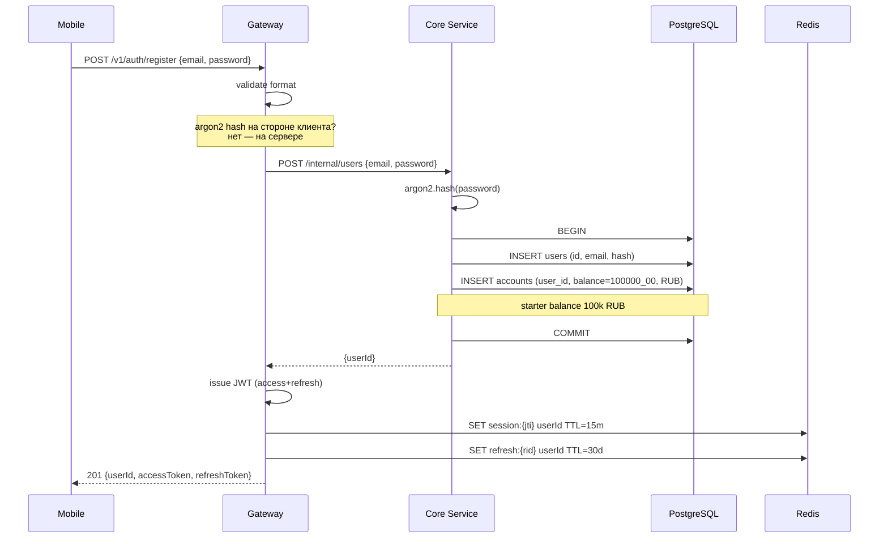

**Инварианты:**
- Email уникален (UNIQUE-индекс).
- Стартовый баланс начисляется в той же транзакции, что и `users`.
- Токены выдаются только если транзакция успешна.

---

## 10.3. S2 — Логин

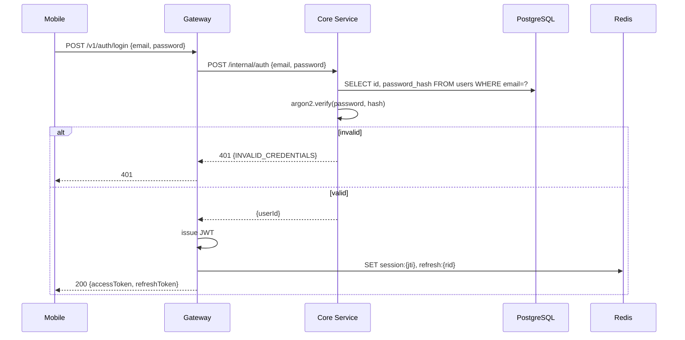

### S2-bis — Refresh

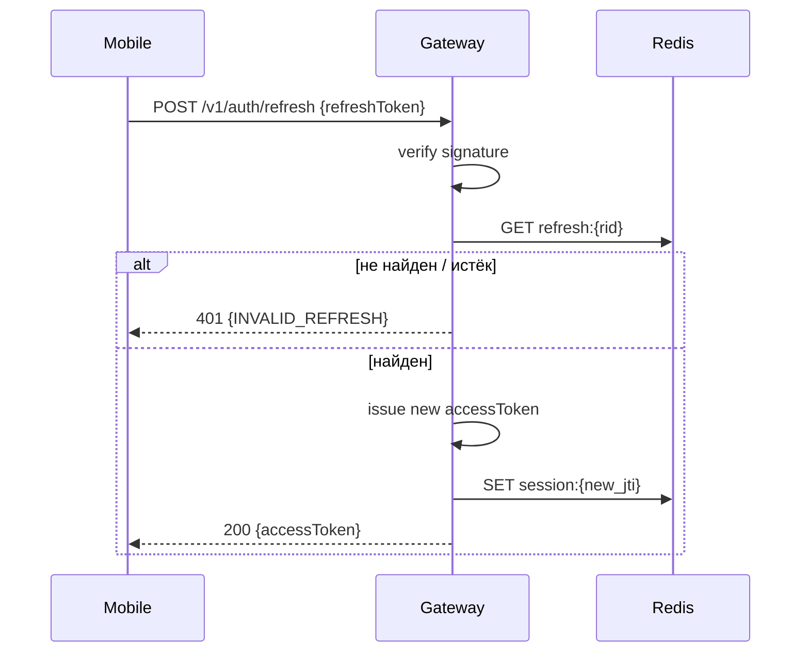

---

## 10.4. S3 — Подписка на котировки

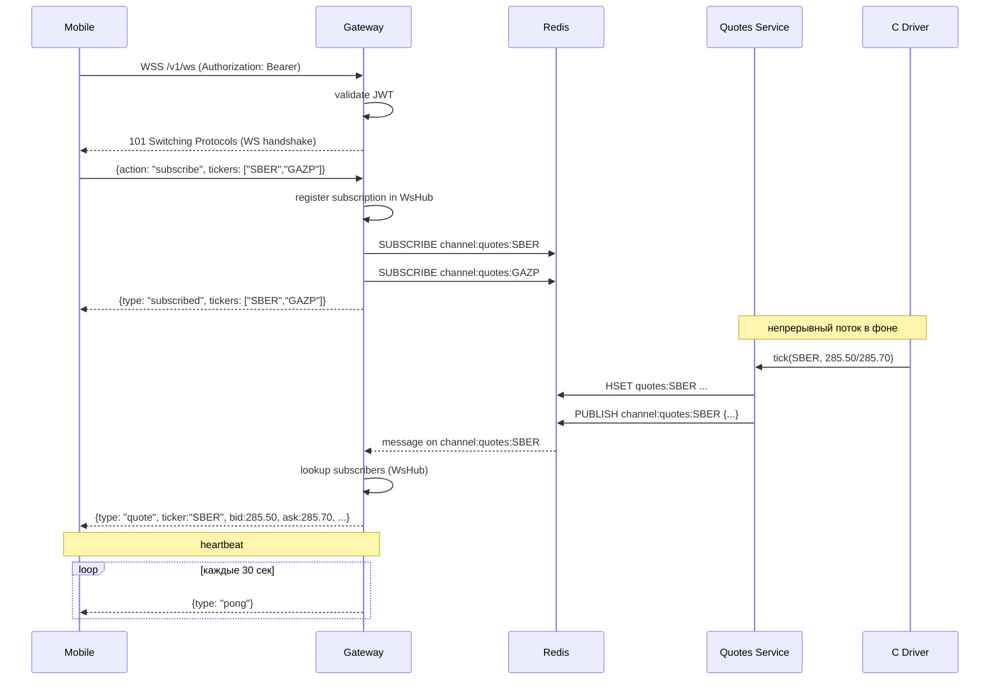

**Особенности:**
- Подписка добавляет тикеры в map `userId → Set<ticker>` внутри WsHub.
- Один процесс Gateway — один SUBSCRIBE на канал. При нескольких клиентах на один тикер канал не дублируется.
- При unsubscribe — если на канале не осталось клиентов, делаем UNSUBSCRIBE (опционально).

---

## 10.5. S4 — История котировок (график)

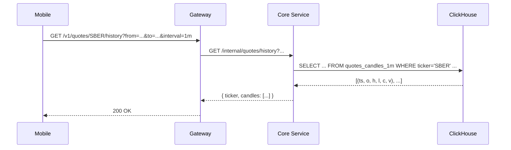

**Кэширование:**
- Можно добавить ETag / `If-None-Match` — для одного и того же `from/to/interval` ответ детерминирован (кроме самой свежей минуты).
- В MVP — без кэша, ClickHouse достаточно быстр.

---

## 10.6. S5 — Покупка акций (BUY)

Самый ответственный сценарий — здесь живут деньги.

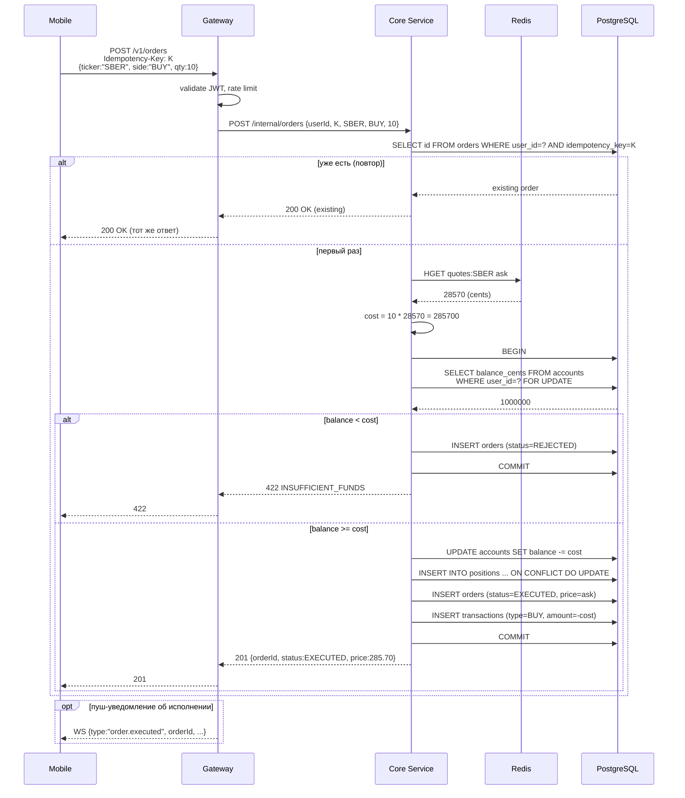

**Что важно:**
- Идемпотентность по `K` — двойной клик не списывает деньги дважды.
- `FOR UPDATE` на `accounts` сериализует параллельные ордера одного пользователя.
- Цена из Redis (`ask`) фиксируется ДО `BEGIN`, чтобы транзакция была короткой.
- Все мутации — в одной транзакции PostgreSQL.

---

## 10.7. S6 — Продажа акций (SELL)

Симметрично BUY, но с проверкой позиции вместо баланса.

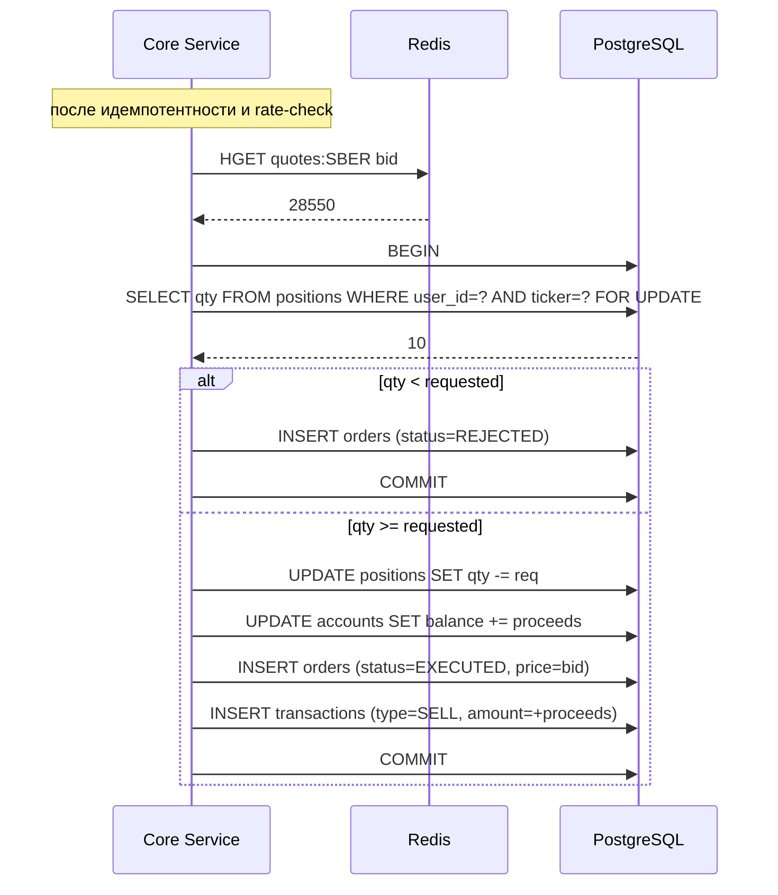

---

## 10.8. S7 — Портфель и история

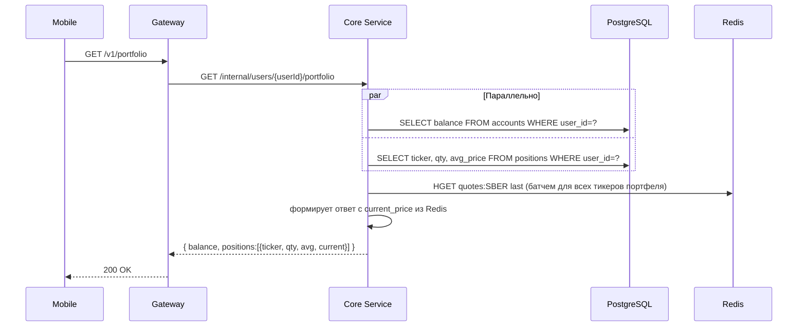

`current_price` берётся из Redis, чтобы не делать join с ClickHouse каждый раз.

---

## 10.9. S8 — Реконнект мобильного клиента

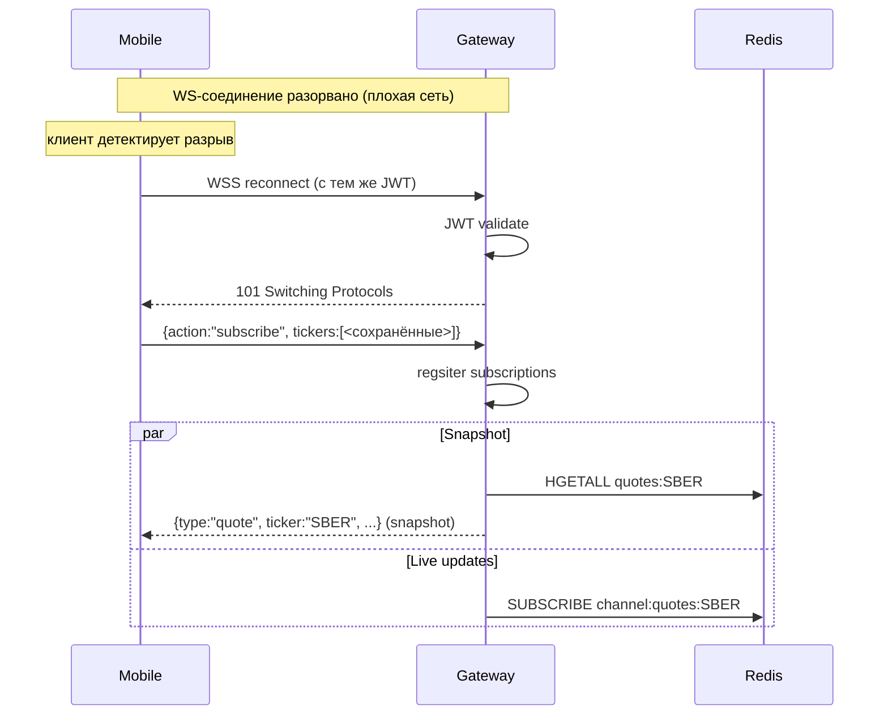

**Свойства:**
- При reconnect клиент получает **snapshot текущей цены**, чтобы не ждать следующего тика.
- Дальше — обычные live-тики.
- Никакой репликации/догона пропущенных тиков (eventual consistency).

---

## 10.10. S9 — End-to-end путь котировки

Это пайплайн, который объединяет драйвер → клиента в одной картине.

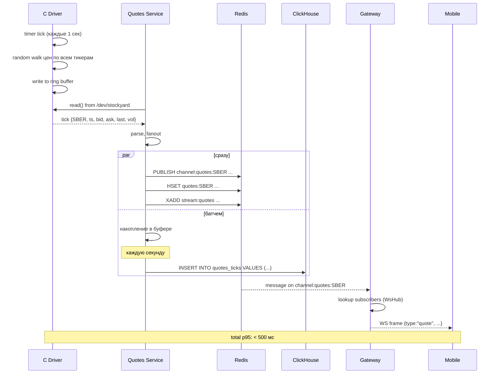

---

## 10.11. S10 — Прогон Load Simulator

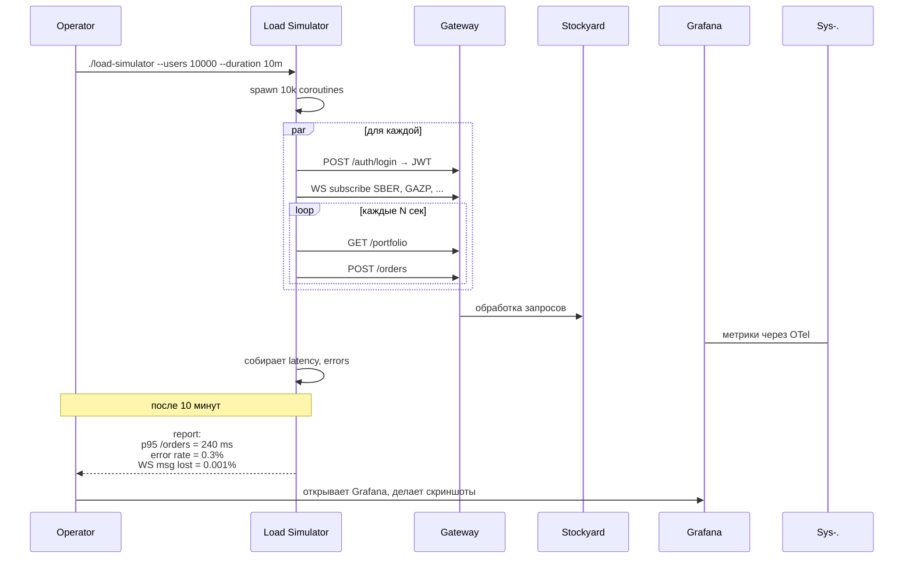

Результаты прогона идут в раздел «Тестирование» отчёта.

---

## 10.12. Покрытие сценариями компонентов системы

| Сценарий | Сервисы | Тип взаимодействия | Хранилища | Среда |
|---|---|---|---|---|
| S1 Register | GW, DB | sync HTTP, INSERT | PostgreSQL, Redis | Dev/Demo |
| S2 Login | GW, DB | sync HTTP, SELECT | PostgreSQL, Redis | Dev/Demo |
| S3 Subscribe | GW, Quotes, Driver | WS, Pub/Sub | Redis | Dev/Demo |
| S4 History | GW, DB | sync HTTP, SELECT | ClickHouse | Dev/Demo |
| S5 Buy | GW, DB | TX, FOR UPDATE | PostgreSQL, Redis | Dev/Demo |
| S6 Sell | GW, DB | TX, FOR UPDATE | PostgreSQL, Redis | Dev/Demo |
| S7 Portfolio | GW, DB | параллельные SELECT | PostgreSQL, Redis | Dev/Demo |
| S8 Reconnect | GW | WS reconnect, snapshot | Redis | Dev/Demo |
| S9 Tick pipeline | Driver, Quotes, GW | end-to-end stream | Redis, ClickHouse | Dev/Demo |
| S10 Load test | все | массовый ramp-up | все хранилища | Demo |

---

## Связанные документы

- ⬅ [09. Наблюдаемость](09-observability.md)
- ➡ [11. Стратегия тестирования](11-testing.md)
- ↩ [README](README.md)
