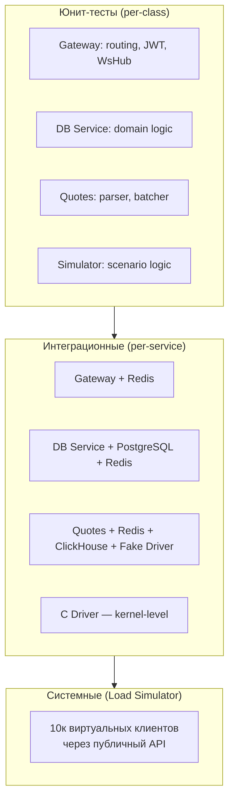

# 11. Стратегия тестирования

## Назначение

Описать **три уровня тестов** (модульный, интеграционный, системный) и **тестовое инструментальное обеспечение** на Kotlin / Go / Python — этого требует ТЗ §6.9.

Каждый уровень отвечает на свой вопрос:

| Уровень | Вопрос | Где работает |
|---|---|---|
| **Модульный (unit)** | Корректна ли отдельная функция/класс? | внутри одного сервиса, без внешних зависимостей |
| **Интеграционный** | Корректно ли сервис работает с реальным PG/Redis/CH/драйвером? | один сервис + его зависимости |
| **Системный** | Соответствует ли вся система SLO под нагрузкой? | вся развёрнутая система |

---

## 11.1. Уровни тестирования



**Пирамида тестов** (по числу): много юнит-тестов → меньше интеграционных → ещё меньше системных. Юнит-тесты быстрые (миллисекунды), системные — медленные (минуты).

---

## 11.2. Модульные (юнит-) тесты

### 11.2.1. Инструменты

| Сервис | Фреймворк |
|---|---|
| API Gateway | JUnit 5 + Kotest assertions + MockK |
| DB Service | JUnit 5 + Kotest + MockK |
| Quotes Service | стандартный `testing` пакет Go + `testify` |
| Load Simulator | JUnit 5 (если Kotlin) / `pytest` / `go test` |
| C Driver | `kunit` / встроенные тесты + минимальный user-space harness |

Запускаются из IntelliJ IDEA (как требует ТЗ §6.9) или через Gradle/Go test.

### 11.2.2. Что юнит-тестируем — карта по сервисам

#### API Gateway (Kotlin)
| Класс / модуль | Тест |
|---|---|
| `JwtVerifier` | валидный токен, expired, неверная подпись, отсутствие `sub` |
| `RateLimiter` | n+1 запрос отклоняется, окно сбрасывается |
| `WsHub` | подписка/отписка, fanout по тикеру, отключение зомби |
| `DbServiceClient` | retry с экспонентой, timeout, маппинг ошибок |
| route handlers | 200 / 401 / 422 для типовых вводов (через `Ktor testApplication`) |

#### DB Service (Kotlin)
| Класс / модуль | Тест |
|---|---|
| `OrderService.placeOrder` | BUY с достаточным балансом, BUY с недостатком (`INSUFFICIENT_FUNDS`), SELL с недостатком позиции, повтор по idempotency-key |
| `PortfolioService` | пустой портфель, портфель с N позициями |
| `UserService` | хэш argon2 совпадает, валидация email |
| `OrderRepository` (через Testcontainers — это уже интеграция, см. 11.3) | — |

#### Quotes Service (Go)
| Класс / модуль | Тест |
|---|---|
| `parser.Parse` | валидный binary tick, повреждённый payload, EOF |
| `pipeline.Fanout` | сообщение приходит ко всем sink-ам |
| `sinks.RedisPublisher` (mock-redis) | publish + hset + xadd за один вызов |
| `sinks.ClickHouseBatcher` | размер батча, flush по таймеру |

#### Load Simulator
| Класс / модуль | Тест |
|---|---|
| `ScenarioRunner` | ramp-up распределяет нагрузку по N клиентам |
| `VirtualUser` | retry на сетевых ошибках, корректное закрытие WS |
| `Histogram` | p50/p95/p99 на известных распределениях |

### 11.2.3. Целевое покрытие
- Бизнес-логика (domain layer DB Service): **≥ 80%**.
- Транспорт и инфраструктура: **≥ 50%**.
- Generated/configuration: не считаем.

---

## 11.3. Интеграционные тесты

### 11.3.1. Принципы

- Тесты гоняются с **реальными зависимостями** (PostgreSQL, Redis, ClickHouse), поднятыми в Docker через **Testcontainers** для Kotlin или `docker-compose` для Go/Python.
- **Не моки** там, где можно поднять реальный сервис: разница в поведении PG mock vs PG real — главный источник production-багов.
- Идут отдельной Gradle/Go-задачей `:integrationTest`, чтобы не тормозить юнит-цикл.

### 11.3.2. Карта интеграционных проверок

#### IT-1: DB Service ↔ PostgreSQL
**Цель:** проверить SQL, миграции, транзакции, констрейнты.

```kotlin
@Testcontainers
class OrderServiceIT {
    @Container
    val pg = PostgreSQLContainer("postgres:16")

    @Test fun `concurrent BUY от одного user — ровно один EXECUTED при нехватке`() {
        // 100 параллельных BUY на ордер, перекрывающий баланс ровно один раз
        // ожидание: 1 EXECUTED + 99 REJECTED, инвариант balance >= 0
    }

    @Test fun `повтор по idempotency-key — ордер один`() {
        // 50 параллельных запросов с одним K
        // ожидание: 1 запись в orders, все ответы одинаковые
    }

    @Test fun `SELL с недостатком позиции — REJECTED, позиция не уходит в минус`() { ... }
}
```

#### IT-2: DB Service ↔ Redis
**Цель:** чтение текущей цены при исполнении.

- Quote есть в Redis → ордер исполняется по этой цене.
- Quote отсутствует → REJECTED с кодом `NO_QUOTE_AVAILABLE`.

#### IT-3: Gateway ↔ DB Service ↔ Redis (контрактный тест)
**Цель:** end-to-end внутри backend, без C-драйвера и мобилок.

- POST /v1/orders с реальным JWT → PostgreSQL содержит запись.
- WS-подписка → клиент получает тики, опубликованные напрямую в Redis.

#### IT-4: Quotes Service ↔ Redis ↔ ClickHouse (с Fake Driver)
**Цель:** проверить пайплайн котировок без реального драйвера.

```go
func TestPipelineIT(t *testing.T) {
    fakeDriver := NewFakeDriver()
    fakeDriver.Emit(Tick{Ticker: "SBER", Bid: 28550, Ask: 28570})

    quotesSvc := NewService(fakeDriver, redisClient, chClient)
    quotesSvc.Start(ctx)

    // assert: HGET quotes:SBER → 28550/28570
    // assert: PUBLISH dispatched (через subscribe в тесте)
    // assert: SELECT FROM quotes_ticks → 1 row через 1 сек (батч)
}
```

#### IT-5: C Driver
**Цель:** убедиться, что драйвер корректно отдаёт тики и не падает под нагрузкой.

- Тестовый user-space скрипт читает `/dev/stockyard` 60 секунд, считает количество и проверяет монотонность `ts_ns`.
- Проверка `poll()` / `epoll()` поведения.

### 11.3.3. Запуск интеграционных тестов

```bash
# Kotlin (Gradle)
./gradlew :db-service:integrationTest

# Go
go test -tags=integration ./...

# Все вместе через docker-compose (test profile)
docker compose -f deploy/docker-compose.test.yml up --abort-on-container-exit
```

CI запускает на каждый push в основную ветку.

---

## 11.4. Системные тесты (Load Simulator)

### 11.4.1. Назначение

Доказать, что вся развёрнутая система соответствует SLO при заявленной нагрузке (10 000 одновременных клиентов — требование ТЗ).

### 11.4.2. Сценарии

| Сценарий | Параметры | Цель |
|---|---|---|
| **smoke** | 10 клиентов, 30 сек | Проверка работоспособности после деплоя |
| **realistic** | 10 000 клиентов, 10 минут, mix 80% read / 20% write | Базовый прогон для отчёта |
| **stress** | плавный ramp-up 0 → 30к за 10 мин | Найти точку отказа |
| **soak** | 5 000 клиентов, 1 час | Поиск утечек памяти / FD |

### 11.4.3. Acceptance criteria для realistic-прогона

| SLI | Цель |
|---|---|
| WS push p95 (от Quotes до Mobile) | < 500 мс |
| `POST /orders` p95 | < 300 мс |
| Error rate (5xx) | < 1% |
| WS messages dropped | < 0.1% |
| Quote freshness | 99% тиков моложе 1 сек |
| Корректность инвариантов в БД | `SUM(transactions.amount) = balance - initial_deposit` для каждого пользователя |

Если хоть один критерий не выполнен — тест **fail**, нужно искать узкое место по дашбордам Grafana и фиксить.

### 11.4.4. Артефакты для отчёта

После каждого зачётного прогона:
1. Скриншот дашборда **Stockyard Overview** (см. [09. Наблюдаемость](09-observability.md)).
2. CSV / JSON с гистограммами latency.
3. Один пример end-to-end трейса из Jaeger.
4. Сравнительная таблица SLI vs SLO.

Эти артефакты прикладываются к разделу «Тестирование» отчёта.

---

## 11.5. Тестовое инструментальное обеспечение

ТЗ §6.9 явно требует «тестовое инструментальное обеспечение на Kotlin / Go / Python». Это **отдельные исполняемые компоненты**, помогающие тестировать систему.

### 11.5.1. Состав

| Инструмент | Язык | Назначение |
|---|---|---|
| **Load Simulator** | Kotlin (или Go/Python) | имитация 10к клиентов, см. [03. Внутреннее устройство сервисов §3.4](03-components.md) |
| **Fake Driver** | Go | подмена `/dev/stockyard` на программный stub для интеграционных тестов Quotes Service |
| **Test Data Factory** | Kotlin | генерация тестовых пользователей/ордеров для интеграции |
| **DB Invariant Checker** | Python (или Kotlin) | post-test скрипт: бежит по PG и проверяет глобальные инварианты (баланс = сумма транзакций) |
| **Trace Replayer** | Python | взять prod-трейс из Jaeger, воспроизвести запросы — для регрессии |

### 11.5.2. Fake Driver (для IT-4)

Минимальный stub, эмулирующий character device:

```go
type FakeDriver struct {
    ticks chan Tick
}

func (f *FakeDriver) Emit(t Tick)           { f.ticks <- t }
func (f *FakeDriver) Read(buf []byte) (int, error) {
    t := <-f.ticks
    return marshalTick(t, buf), nil
}
```

В интеграционных тестах подменяет `os.OpenFile("/dev/stockyard")` на FakeDriver через интерфейс. Позволяет команде писать тесты на macOS, не имея Linux-драйвера локально.

### 11.5.3. DB Invariant Checker

```python
# scripts/check_invariants.py
def check_balance_consistency(pg):
    rows = pg.execute("""
        SELECT u.id, a.balance_cents,
               COALESCE(SUM(t.amount_cents), 0) AS sum_txn
        FROM users u
        JOIN accounts a ON a.user_id = u.id
        LEFT JOIN transactions t ON t.user_id = u.id
        GROUP BY u.id, a.balance_cents
    """)
    for row in rows:
        expected = INITIAL_DEPOSIT + row.sum_txn
        assert row.balance_cents == expected, f"User {row.id}: {row.balance_cents} != {expected}"
```

Запускается после каждого realistic-прогона.

---

## 11.6. CI / автоматизация

| Этап | Триггер | Что запускается |
|---|---|---|
| Pre-commit hook | каждый коммит | формат + статика (ktlint, gofmt) |
| Push в feature-branch | PR | юнит-тесты всех сервисов |
| Push в main | merge | юнит + интеграционные |
| Manual dispatch | по запросу | системные (Load Simulator → demo-стенд) |
| Перед защитой | один раз | full system test (realistic 10k × 10m) |

Минимальный pipeline для GitHub Actions / GitLab CI:

```yaml
test:
  - run: ./gradlew test            # юнит
  - run: ./gradlew integrationTest # с Testcontainers
  - run: cd quotes-service && go test -tags=integration ./...
```

---

## 11.7. Что НЕ покрываем тестами в MVP

| Что | Почему пропускаем |
|---|---|
| End-to-end UI-тесты Android (Espresso) | mobile-разработка тестируется вручную из-за ограничений по времени |
| Mutation testing | overkill для учебного MVP |
| Chaos engineering | не предусмотрено ТЗ |
| Property-based testing бизнес-логики | nice-to-have, не критично |
| Тесты безопасности (penetration) | не предусмотрено ТЗ |

---

## 11.8. Чек-лист готовности к сдаче

- [ ] Юнит-тесты проходят на каждом сервисе (`./gradlew test`, `go test`)
- [ ] Интеграционные тесты с Testcontainers зелёные
- [ ] Fake Driver работает без Linux ядра
- [ ] Load Simulator прошёл `realistic` 10k × 10m с выполнением SLO
- [ ] DB Invariant Checker не нашёл расхождений после прогона
- [ ] Скриншоты дашбордов и трейсов сохранены для отчёта
- [ ] Сводная таблица SLI vs SLO готова

---

## Связанные документы

- ⬅ [10. Ключевые сценарии](10-scenarios.md)
- ↩ [README](README.md)
- См. также: [07. Согласованность](07-consistency.md) (SQL-инварианты), [09. Наблюдаемость](09-observability.md) (метрики и SLO)
